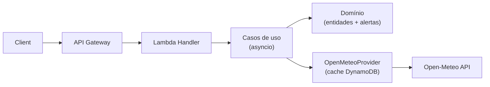

# BKD Weather Forecast
Lambda 100% assíncrona que entrega clima atual, previsões horárias/diárias e alertas inteligentes para municípios brasileiros usando Open‑Meteo como fonte única, cache DynamoDB e observabilidade Datadog.

## Visão geral rápida
- **Clean Architecture** com camadas separadas (input adapter, casos de uso, domínio puro, infraestrutura e utilitários compartilhados).
- **Fonte única + cache**: Open‑Meteo (hourly/daily) com cache DynamoDB (TTL 1h/3h) e retries para 429/503.
- **Alertas proprietários**: intensidade de chuva com sigmoide, vento, visibilidade, UV e tendências de temperatura até 7 dias.
- **Escalável e rastreável**: event loop global reutilizado em warm starts, aiohttp/aioboto3 e tracing/logs via Datadog + AWS Powertools.



## Navegação da documentação (clique para abrir)

### 📚 Documentação Arquitetural
- **Clean Architecture:** [`docs/architecture/clean-architecture.md`](docs/architecture/clean-architecture.md)
  - Princípios SOLID e inversão de dependências
  - Estrutura de camadas (Domínio, Aplicação, Infraestrutura, Shared)
  - Exemplos práticos de código e padrões aplicados
  - Fluxo completo de requisição com diagramas sequenciais
  
- **Visão Geral da Arquitetura:** [`docs/architecture/overview.md`](docs/architecture/overview.md)
  - Estrutura de pastas detalhada
  - Componentes críticos (SessionManager, AlertsGenerator, Mapper)
  - Decisões arquiteturais (event loop global, cache, fonte única)
  - Métricas de performance e custos operacionais

### 🌐 Documentação da API
- **Rotas e Endpoints:** [`docs/api/routes.md`](docs/api/routes.md)
  - Especificação completa de todas as rotas
  - Parâmetros, validações e erros
  - **Exemplos de respostas reais** com dados da API local
  - Guia de testes locais (curl, Postman)

### 💻 Documentação de Desenvolvimento
- **Modelo de Domínio:** [`docs/development/domain-model.md`](docs/development/domain-model.md)
  - Entidades, Value Objects e Domain Services
  - Diagramas de classes e relacionamentos
  - Exemplos de código: Weather, HourlyForecast, DailyForecast
  - Fórmulas: intensidade de chuva, sensação térmica, classificação de clima
  
- **Alertas Meteorológicos:** [`docs/development/alerts.md`](docs/development/alerts.md)
  - Tipos de alertas (chuva, vento, visibilidade, temperatura, UV)
  - Severidades e códigos
  - Lógica de geração e deduplicação

### 🚀 Documentação de Infraestrutura
- **Deploy e Terraform:** [`docs/infrastructure/terraform.md`](docs/infrastructure/terraform.md)
  - **Guia completo de variáveis** (Lambda, API Gateway, DynamoDB, Datadog)
  - **Estrutura de módulos** (lambda, api-gateway, observability)
  - **Fluxo passo-a-passo de deploy** (build → plan → apply)
  - Troubleshooting, custos e boas práticas

- **Deployment Overview:** [`docs/infrastructure/deployment.md`](docs/infrastructure/deployment.md)
  - Build e empacotamento da Lambda
  - Configuração de variáveis de ambiente
  - Observabilidade com Datadog e CloudWatch

## Rotas principais
- `GET /api/weather/city/{cityId}` — clima atual/projetado (usa hourly + daily, retorna alertas).
- `GET /api/weather/city/{cityId}/detailed` — previsões detalhadas (current + daily 16d + hourly 48h).
- `POST /api/weather/regional` — clima em paralelo para múltiplas cidades.
- `GET /api/cities/neighbors/{cityId}` — cidades vizinhas dentro do raio.

## Pilares de negócio
- **Classificação própria de clima**: códigos 100–999 baseados em intensidade composta (volume × probabilidade sigmoide), vento, nuvens e visibilidade.
- **Alertas enriquecidos**: chuva/temporal, vento, visibilidade, frio/neve, UV extremo, tendências de temperatura e acumulado diário.
- **Timezone e formatos**: todas as respostas retornam `America/Sao_Paulo`, campos camelCase e valores arredondados para UI.
- **Clean Architecture**: separação rigorosa entre domínio (regras de negócio), aplicação (casos de uso) e infraestrutura (adapters). Ver [`docs/architecture/clean-architecture.md`](docs/architecture/clean-architecture.md).

## Tecnologias Principais
- **Runtime:** Python 3.13 + asyncio (100% assíncrono)
- **Infraestrutura:** AWS Lambda + API Gateway + DynamoDB (cache)
- **IaC:** Terraform (módulos: lambda, api-gateway, observability)
- **Observabilidade:** Datadog APM + CloudWatch + AWS Lambda Powertools
- **Provider Meteorológico:** Open-Meteo API (fonte única)
- **Testes:** pytest + pytest-asyncio + coverage

## Quick Start Local

### Pré-requisitos
```bash
python3.13 -m venv .venv
source .venv/bin/activate
pip install -r lambda/requirements-dev.txt
```

### Rodar Servidor Local
```bash
cd lambda
python local_server.py
# Servidor inicia em http://localhost:8000
```

### Testar Rotas
```bash
# Clima de uma cidade
curl "http://localhost:8000/api/weather/city/3543204"

# Previsão detalhada (16 dias + 48 horas)
curl "http://localhost:8000/api/weather/city/3543204/detailed"

# Cidades vizinhas
curl "http://localhost:8000/api/cities/neighbors/3543204?radius=50"

# Clima regional (múltiplas cidades)
curl -X POST "http://localhost:8000/api/weather/regional" \
  -H "Content-Type: application/json" \
  -d '{"cityIds":["3543204","3550506"]}'
```

### Rodar Testes
```bash
cd lambda
pytest tests/ --cov=. --cov-report=html
# Relatório de coverage em htmlcov/index.html
```

## Pastas chave
- `lambda/` — código da Lambda (domínio, aplicação, infraestrutura, shared, testes)
  - `domain/` — entidades, value objects, domain services (regras de negócio puras)
  - `application/` — use cases, ports (input/output), DTOs
  - `infrastructure/` — adapters (lambda handler, providers, cache, repositórios)
  - `shared/` — utils, config, logger
  - `tests/` — testes unitários e de integração (pytest)
- `docs/` — documentação detalhada por tema (arquitetura, API, desenvolvimento, infraestrutura)
- `terraform/` — infraestrutura como código (Lambda, API Gateway, DynamoDB, Datadog layers)
  - `modules/` — módulos reutilizáveis (lambda, api-gateway, observability)
- `scripts/` — automações de build/test/deploy

## Deploy em Produção

### 1. Build e Empacotamento
```bash
bash scripts/deploy-main.sh
# Gera terraform/build/lambda_function.zip (~15-20 MB)
```

### 2. Configurar Terraform
Edite `terraform/terraform.tfvars`:
```hcl
aws_region           = "us-east-1"
project_name         = "bkd-weather-forecast"
environment          = "production"
lambda_function_name = "bkd-weather-forecast-api"
lambda_timeout       = 60
lambda_memory_size   = 512

cache_table_name = "weather-forecast-cache"

# Datadog (substitua pelos seus ARNs)
datadog_api_key_secret_arn  = "arn:aws:secretsmanager:..."
datadog_layer_arn           = "arn:aws:lambda:us-east-1:..."
datadog_extension_layer_arn = "arn:aws:lambda:us-east-1:..."
```

### 3. Deploy com Terraform
```bash
cd terraform
terraform init
terraform plan -var-file=terraform.tfvars
terraform apply -var-file=terraform.tfvars
```

### 4. Validar
```bash
API_URL=$(terraform output -raw api_gateway_url)
curl "$API_URL/api/weather/city/3543204"
```

**Para detalhes completos:** [`docs/infrastructure/terraform.md`](docs/infrastructure/terraform.md)

---

## Arquitetura Técnica

### Fluxo de Requisição (Exemplo)
```
Cliente → API Gateway → Lambda Handler (Input Adapter)
  → Use Case (Application) → Provider (Infrastructure)
    → Cache DynamoDB (hit/miss) → Open-Meteo API
  → Domain Services → Entidades (Weather, Alerts)
  → Response (camelCase JSON) → Cliente
```

### Camadas (Clean Architecture)
1. **Domínio:** regras de negócio puras (Weather, City, AlertsGenerator)
2. **Aplicação:** casos de uso (GetCityWeatherUseCase, GetRegionalWeatherUseCase)
3. **Infraestrutura:** adapters (OpenMeteoProvider, DynamoDBCache, LambdaHandler)
4. **Shared:** utilitários cross-cutting (logger, config, date parser)

**Diagrama completo:** [`docs/architecture/clean-architecture.md`](docs/architecture/clean-architecture.md)

---

## Métricas e Performance

| Métrica | Valor (Produção) |
|---------|------------------|
| **P50 Latency** (cache hit) | ~50ms |
| **P99 Latency** (cache hit) | ~150ms |
| **Cache Hit Rate** | 80-90% |
| **Cold Start** | ~1200ms (com Datadog layers) |
| **Custo Mensal** (100k req/mês) | ~$12-16 (sem Datadog) |

**Detalhes:** [`docs/architecture/overview.md#disponibilidade-e-performance`](docs/architecture/overview.md#disponibilidade-e-performance)

---

## Contribuindo

### Executar Testes
```bash
cd lambda
pytest tests/unit -v          # Testes unitários (sem I/O)
pytest tests/integration -v   # Testes de integração (com APIs)
pytest tests/ --cov           # Com coverage
```

### Padrões de Código
- **Formatação:** black + isort
- **Linting:** pylint + flake8
- **Type hints:** mypy (opcional mas recomendado)
- **Docstrings:** Google style

### Estrutura de Commits
```
feat: adicionar alerta de neve
fix: corrigir cálculo de feels_like para temp < 0°C
docs: atualizar README com exemplos de API
refactor: extrair lógica de sigmoide para helper
test: adicionar testes para RainfallCalculator
```

Para detalhes completos de arquitetura, rotas, domínios, tipos de alerta e deploy, siga os links acima — cada seção abre o arquivo correspondente.
