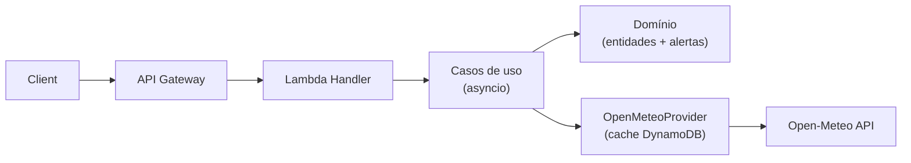

# BKD Weather Forecast
Lambda 100% assíncrona que entrega clima atual, previsões horárias/diárias e alertas inteligentes para municípios brasileiros usando Open‑Meteo como fonte única, cache DynamoDB e observabilidade Datadog.

## Visão geral rápida
- **Clean Architecture** com camadas separadas (input adapter, casos de uso, domínio puro, infraestrutura e utilitários compartilhados).
- **Fonte única + cache**: Open‑Meteo (hourly/daily) com cache DynamoDB (TTL 1h/3h) e retries para 429/503.
- **Alertas proprietários**: intensidade de chuva com sigmoide, vento, visibilidade, UV e tendências de temperatura até 7 dias.
- **Escalável e rastreável**: event loop global reutilizado em warm starts, aiohttp/aioboto3 e tracing/logs via Datadog + AWS Powertools.

## Navegação da documentação (clique para abrir)
- Arquitetura e fluxos: [`docs/architecture/overview.md`](docs/architecture/overview.md)
- Rotas, parâmetros e retornos: [`docs/api/routes.md`](docs/api/routes.md)
- Modelo de domínio (entidades, VOs, constantes): [`docs/development/domain-model.md`](docs/development/domain-model.md)
- Regras e tipos de alertas: [`docs/development/alerts.md`](docs/development/alerts.md)
- Deploy e infraestrutura AWS/Terraform: [`docs/infrastructure/deployment.md`](docs/infrastructure/deployment.md)

## Rotas principais
- `GET /api/weather/city/{cityId}` — clima atual/projetado (usa hourly + daily, retorna alertas).
- `GET /api/weather/city/{cityId}/detailed` — previsões detalhadas (current + daily 16d + hourly 48h).
- `POST /api/weather/regional` — clima em paralelo para múltiplas cidades.
- `GET /api/cities/neighbors/{cityId}` — cidades vizinhas dentro do raio.

## Pilares de negócio
- **Classificação própria de clima**: códigos 100–999 baseados em intensidade composta (volume × probabilidade), vento, nuvens e visibilidade.
- **Alertas enriquecidos**: chuva/temporal, vento, visibilidade, frio/neve, UV extremo, tendências de temperatura e acumulado diário.
- **Timezone e formatos**: todas as respostas retornam `America/Sao_Paulo`, campos camelCase e valores arredondados para UI.

## Pastas chave
- `lambda/` — código da Lambda (domínio, aplicação, infraestrutura, shared, testes).
- `docs/` — documentação detalhada por tema.
- `terraform/` — infraestrutura como código (Lambda, API Gateway, DynamoDB, Datadog layers).
- `scripts/` — automações de build/test/deploy.

Para detalhes completos de arquitetura, rotas, domínios, tipos de alerta e deploy, siga os links acima — cada seção abre o arquivo correspondente.
