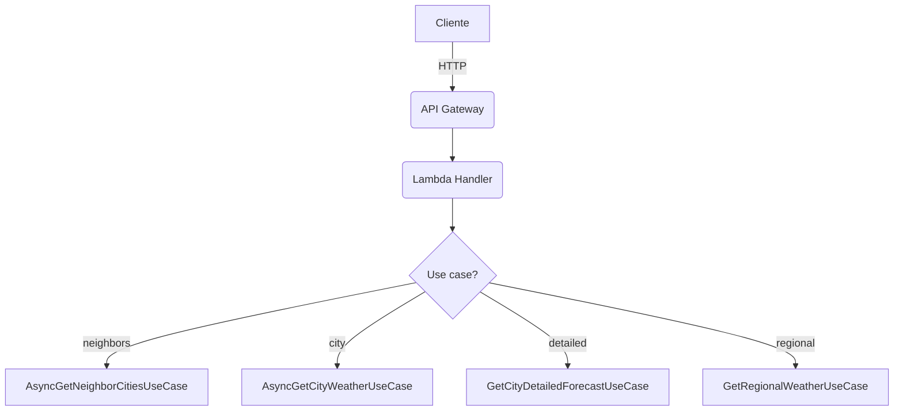
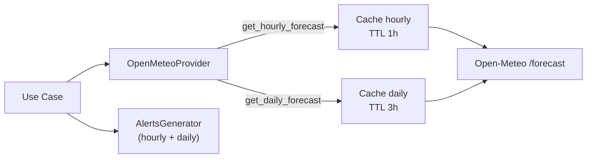

# Rotas da API

## Sumário rápido
- `GET /api/cities/neighbors/{cityId}?radius=50` — retorna cidade central + vizinhas dentro do raio.
- `GET /api/geo/municipalities/{cityId}` — proxy do GeoJSON do IBGE com cache (TTL 7 dias).
- `GET /api/weather/city/{cityId}?date=YYYY-MM-DD&time=HH:MM` — clima atual/projetado para a data/hora alvo.
- `GET /api/weather/city/{cityId}/detailed?...` — previsão detalhada (current extraído do hourly + daily 16 dias + hourly 48h).
- `POST /api/weather/regional?...` — clima em paralelo para múltiplas cidades (lista no corpo).



## Parâmetros comuns
- `date` (query, opcional): `YYYY-MM-DD`. Se omitido, usa próximo horário disponível.
- `time` (query, opcional): `HH:MM`. Se omitido, usa 12:00.
- `cityId` (path): string numérica do município (IBGE).
- `radius` (query em neighbors): km, entre 1 e 500.
- Corpo da rota regional: `{ "cityIds": ["3543204", "3550506", ...] }`.

Erros de validação são convertidos por `ExceptionHandlerService` em JSON com `type`, `error`, `message` e `details`.

### GeoJSON (IBGE)
- Rota `GET /api/geo/municipalities/{cityId}` devolve exatamente o GeoJSON da API do IBGE.
- Cache DynamoDB com TTL de 7 dias (`ibge_mesh_{cityId}`) para reduzir chamadas ao IBGE.

## Respostas e campos
### Weather (usado em city e regional)
- `cityId`, `cityName`
- `timestamp` (ISO, America/Sao_Paulo)
- `temperature`, `humidity`, `windSpeed`, `windDirection`
- `rainfallIntensity` (0–100), `rainfallProbability` (%), `rainVolumeHour` (mm/h), `dailyRainAccumulation` (mm)
- `description`, `feelsLike`, `pressure`, `visibility`, `clouds`, `cloudsDescription`
- `tempMin`, `tempMax`, `isDay`
- `weatherCode` (código proprietário) e `weatherAlert` (lista de alertas estruturados)

### ExtendedForecast (rota detailed)
- `cityInfo`: `cityId`, `cityName`, `state`
- `currentWeather`: Weather acima
- `dailyForecasts[]` (16 dias): `date`, `tempMin/Max`, `precipitationMm`, `rainProbability`, `rainfallIntensity`, `windSpeed/Direction`, `uvIndex`, `uvRiskLevel/Color`, `sunrise/sunset`, `precipitationHours`, `daylightHours`, `weatherCode`, `description`
- `hourlyForecasts[]` (48h): `timestamp`, `temperature`, `precipitation`, `precipitationProbability`, `rainfallIntensity`, `humidity`, `windSpeed/Direction`, `cloudCover`, `pressure?`, `visibility?`, `uvIndex?`, `isDay?`, `apparentTemperature?`, `weatherCode`, `description`
- `extendedAvailable`: `true|false`, `forecastDays`

### Neighbor cities
- `centerCity`: `id`, `name`, `latitude`, `longitude`
- `neighbors[]`: `id`, `name`, `latitude`, `longitude`, `distance`

## Erros padrão
| HTTP | Tipo                        | Quando                                                |
|------|-----------------------------|-------------------------------------------------------|
| 400  | `InvalidRadiusException`    | Raio fora do intervalo permitido                      |
| 400  | `InvalidDateTimeException`  | Formato de `date`/`time` inválido                     |
| 400  | `ValidationError`           | `cityIds` não é array ou `cityId` não numérico        |
| 404  | `CityNotFoundException`     | ID não existe no repositório                         |
| 404  | `CoordinatesNotFoundException` | Cidade sem coordenadas                              |
| 404  | `WeatherDataNotFoundException` | Provider sem dados válidos                          |
| 500  | `Internal server error`     | Erro inesperado                                       |

## Exemplos de chamadas
- **Clima da cidade**  
  `GET /api/weather/city/3543204?date=2025-12-01&time=15:00`

- **GeoJSON do município (cache 7d)**  
  `GET /api/geo/municipalities/3543204`

- **Previsão detalhada**  
  `GET /api/weather/city/3543204/detailed?date=2025-12-01`

- **Cidades vizinhas**  
  `GET /api/cities/neighbors/3543204?radius=75`

- **Clima regional**  
  `POST /api/weather/regional?time=09:00`  
  Corpo: `{"cityIds":["3543204","3550506","3543402"]}`

## Fluxo de caching por rota


## Contratos de retorno detalhados
- **Alertas**: ver `docs/development/alerts.md` para a lista de códigos, severidades e campos extras.
- **Domínio**: campos completos de entidades em `docs/development/domain-model.md`.

---

## Exemplos de Respostas Reais

### Exemplo 1: GET /api/weather/city/3543204

**Requisição:**
```bash
GET /api/weather/city/3543204?date=2025-12-08&time=15:00
```

**Resposta (200 OK):**
```json
{
  "cityId": "3543204",
  "cityName": "Ribeirão do Sul",
  "timestamp": "2025-12-09T00:00:00-03:00",
  "temperature": 22.7,
  "humidity": 90.0,
  "windSpeed": 9.3,
  "windDirection": 36,
  "rainfallIntensity": 5,
  "rainfallProbability": 78.0,
  "rainVolumeHour": 1.8,
  "dailyRainAccumulation": 12.0,
  "description": "Garoa leve",
  "feelsLike": 25.7,
  "pressure": 1009.9,
  "visibility": 1700,
  "clouds": 100.0,
  "cloudsDescription": "Céu encoberto",
  "tempMin": 23.2,
  "tempMax": 30.3,
  "isDay": false,
  "weatherCode": 400,
  "weatherAlert": [
    {
      "code": "DRIZZLE",
      "severity": "info",
      "description": "🌦️ Garoa",
      "timestamp": "2025-12-09T00:00:00-03:00",
      "details": {
        "rainMmH": 1.8,
        "probabilityPercent": 78.0,
        "rainEndsAt": "2025-12-09T18:00:00-03:00"
      }
    },
    {
      "code": "LOW_VISIBILITY",
      "severity": "warning",
      "description": "🌫️ Visibilidade reduzida",
      "timestamp": "2025-12-09T00:00:00-03:00",
      "details": {
        "visibilityMeters": 1700
      }
    },
    {
      "code": "MODERATE_RAIN",
      "severity": "warning",
      "description": "🌧️ Chuva moderada",
      "timestamp": "2025-12-09T10:00:00-03:00",
      "details": {
        "rainMmH": 7.8,
        "probabilityPercent": 98.0,
        "rainEndsAt": "2025-12-09T18:00:00-03:00"
      }
    },
    {
      "code": "LIGHT_RAIN",
      "severity": "info",
      "description": "🌧️ Chuva fraca",
      "timestamp": "2025-12-09T13:00:00-03:00",
      "details": {
        "rainMmH": 6.7,
        "probabilityPercent": 98.0,
        "rainEndsAt": "2025-12-09T18:00:00-03:00"
      }
    },
    {
      "code": "HEAVY_RAIN_DAY",
      "severity": "warning",
      "description": "Chuva forte prevista",
      "timestamp": "2025-12-09T00:00:00-03:00",
      "details": {
        "date": "2025-12-09",
        "precipitationMm": 41.9,
        "probabilityPercent": 98.0
      }
    }
  ]
}
```

**Destaques:**
- `weatherCode: 400` indica **garoa leve** (classificação proprietária)
- `rainfallIntensity: 5` calculado pela fórmula composta (volume × probabilidade sigmoide)
- Múltiplos alertas detectados: garoa, visibilidade baixa, chuva moderada/fraca prevista
- `dailyRainAccumulation: 12.0mm` mostra chuva já acumulada no dia
- Timezone: `America/Sao_Paulo` (-03:00)

---

### Exemplo 2: GET /api/weather/city/3543204/detailed

**Requisição:**
```bash
GET /api/weather/city/3543204/detailed
```

**Resposta (200 OK - parcial):**
```json
{
  "cityInfo": {
    "cityId": "3543204",
    "cityName": "Ribeirão do Sul",
    "state": "SP"
  },
  "currentWeather": {
    "cityId": "3543204",
    "cityName": "Ribeirão do Sul",
    "timestamp": "2025-12-09T00:00:00-03:00",
    "temperature": 22.7,
    "humidity": 90.0,
    "windSpeed": 9.3,
    "windDirection": 36,
    "rainfallIntensity": 5,
    "rainfallProbability": 78.0,
    "rainVolumeHour": 1.8,
    "dailyRainAccumulation": 12.0,
    "description": "Garoa leve",
    "feelsLike": 25.7,
    "pressure": 1009.9,
    "visibility": 1700,
    "clouds": 100.0,
    "cloudsDescription": "Céu encoberto",
    "tempMin": 23.2,
    "tempMax": 30.3,
    "isDay": false,
    "weatherCode": 400,
    "weatherAlert": [
      {
        "code": "DRIZZLE",
        "severity": "info",
        "description": "🌦️ Garoa",
        "timestamp": "2025-12-09T00:00:00-03:00",
        "details": {
          "rainMmH": 1.8,
          "probabilityPercent": 78.0,
          "rainEndsAt": "2025-12-09T18:00:00-03:00"
        }
      }
    ]
  },
  "dailyForecasts": [
    {
      "date": "2025-12-08",
      "tempMin": 23.2,
      "tempMax": 30.3,
      "apparentTempMin": 26.1,
      "apparentTempMax": 34.1,
      "precipitationMm": 12.0,
      "rainProbability": 31,
      "rainfallIntensity": 0,
      "windSpeed": 12.4,
      "windSpeedMax": 12.4,
      "windDirection": 41,
      "windDirectionArrow": "↙",
      "uvIndex": 9.2,
      "uvRiskLevel": "Muito Alto",
      "uvRiskColor": "#f44336",
      "sunrise": "05:27",
      "sunset": "18:56",
      "precipitationHours": 12.0,
      "daylightHours": 13.5,
      "weatherCode": 300,
      "description": "Nublado"
    },
    {
      "date": "2025-12-09",
      "tempMin": 18.2,
      "tempMax": 23.5,
      "apparentTempMin": 19.7,
      "apparentTempMax": 25.7,
      "precipitationMm": 41.9,
      "rainProbability": 98,
      "rainfallIntensity": 43,
      "windSpeed": 12.2,
      "windSpeedMax": 12.2,
      "windDirection": 118,
      "windDirectionArrow": "↖",
      "uvIndex": 4.25,
      "uvRiskLevel": "Moderado",
      "uvRiskColor": "#ff9800",
      "sunrise": "05:27",
      "sunset": "18:57",
      "precipitationHours": 21.0,
      "daylightHours": 13.5,
      "weatherCode": 500,
      "description": "Chuva moderada"
    }
  ],
  "hourlyForecasts": [
    {
      "timestamp": "2025-12-08T21:00:00-03:00",
      "temperature": 23.2,
      "precipitation": 0.3,
      "precipitationProbability": 31,
      "rainfallIntensity": 0,
      "humidity": 89,
      "windSpeed": 9.8,
      "windDirection": 41,
      "cloudCover": 100,
      "pressure": 1010.3,
      "visibility": 16600,
      "uvIndex": 0.0,
      "isDay": false,
      "apparentTemperature": 26.1,
      "weatherCode": 300,
      "description": "Nublado"
    },
    {
      "timestamp": "2025-12-08T22:00:00-03:00",
      "temperature": 23.0,
      "precipitation": 0.5,
      "precipitationProbability": 47,
      "rainfallIntensity": 1,
      "humidity": 89,
      "windSpeed": 9.5,
      "windDirection": 39,
      "cloudCover": 100,
      "pressure": 1010.3,
      "visibility": 12800,
      "uvIndex": 0.0,
      "isDay": false,
      "apparentTemperature": 25.9,
      "weatherCode": 300,
      "description": "Nublado"
    }
  ],
  "extendedAvailable": true,
  "forecastDays": 16
}
```

**Destaques:**
- `currentWeather` é extraído do hourly mais próximo à data/hora atual
- `dailyForecasts` retorna até **16 dias** com:
  - Índice UV com nível de risco e cor (ex: "Muito Alto", `#f44336`)
  - Direção do vento com seta (ex: `↙`, `↖`)
  - Horas de precipitação vs horas de luz do dia
- `hourlyForecasts` retorna até **48 horas** com granularidade horária
- `rainfallIntensity` varia de 0-100 (dia 09/12 com 43 = chuva significativa)

---

### Exemplo 3: GET /api/cities/neighbors/3543204?radius=50

**Requisição:**
```bash
GET /api/cities/neighbors/3543204?radius=50
```

**Resposta (200 OK - parcial):**
```json
{
  "centerCity": {
    "id": "3543204",
    "name": "Ribeirão do Sul",
    "latitude": -22.8058,
    "longitude": -49.9925
  },
  "neighbors": [
    {
      "id": "3550506",
      "name": "Santa Cruz do Rio Pardo",
      "latitude": -22.9006,
      "longitude": -49.6325,
      "distance": 35.2
    },
    {
      "id": "3543402",
      "name": "Salto Grande",
      "latitude": -22.8914,
      "longitude": -49.9792,
      "distance": 9.7
    },
    {
      "id": "3535507",
      "name": "Ourinhos",
      "latitude": -22.9789,
      "longitude": -49.8706,
      "distance": 22.4
    }
  ]
}
```

**Destaques:**
- Distâncias calculadas usando **fórmula de Haversine** (precisão geográfica)
- Ordenadas por proximidade crescente
- Raio validado entre 1-500 km (lança `InvalidRadiusException` se fora do range)

---

### Exemplo 4: POST /api/weather/regional?time=09:00

**Requisição:**
```bash
POST /api/weather/regional?time=09:00
Content-Type: application/json

{
  "cityIds": ["3543204", "3550506", "3535507"]
}
```

**Resposta (200 OK - parcial):**
```json
[
  {
    "cityId": "3543204",
    "cityName": "Ribeirão do Sul",
    "timestamp": "2025-12-09T09:00:00-03:00",
    "temperature": 20.5,
    "humidity": 95,
    "windSpeed": 10.2,
    "rainfallIntensity": 12,
    "rainfallProbability": 89,
    "description": "Garoa moderada",
    "weatherCode": 410,
    "weatherAlert": [
      {
        "code": "MODERATE_RAIN",
        "severity": "warning",
        "description": "🌧️ Chuva moderada"
      }
    ]
  },
  {
    "cityId": "3550506",
    "cityName": "Santa Cruz do Rio Pardo",
    "timestamp": "2025-12-09T09:00:00-03:00",
    "temperature": 21.2,
    "humidity": 92,
    "windSpeed": 9.8,
    "rainfallIntensity": 8,
    "rainfallProbability": 76,
    "description": "Garoa leve",
    "weatherCode": 400,
    "weatherAlert": []
  },
  {
    "cityId": "3535507",
    "cityName": "Ourinhos",
    "timestamp": "2025-12-09T09:00:00-03:00",
    "temperature": 20.9,
    "humidity": 94,
    "windSpeed": 11.5,
    "rainfallIntensity": 15,
    "rainfallProbability": 92,
    "description": "Chuva fraca",
    "weatherCode": 500,
    "weatherAlert": [
      {
        "code": "LIGHT_RAIN",
        "severity": "info",
        "description": "🌧️ Chuva fraca"
      }
    ]
  }
]
```

**Destaques:**
- Execução **em paralelo** com `asyncio.gather` e `Semaphore(50)`
- Cache reutilizado entre cidades (se disponível)
- Cada cidade retorna objeto `Weather` completo
- Alertas gerados individualmente por cidade
- Ordem preservada conforme array `cityIds`

---

### Exemplo 5: Erro 404 - Cidade não encontrada

**Requisição:**
```bash
GET /api/weather/city/9999999?date=2025-12-08
```

**Resposta (404 Not Found):**
```json
{
  "type": "CityNotFoundException",
  "error": "City not found",
  "message": "Cidade com ID 9999999 não foi encontrada",
  "details": {
    "cityId": "9999999"
  }
}
```

---

### Exemplo 6: Erro 400 - Parâmetros inválidos

**Requisição:**
```bash
GET /api/cities/neighbors/3543204?radius=999
```

**Resposta (400 Bad Request):**
```json
{
  "type": "InvalidRadiusException",
  "error": "Invalid radius",
  "message": "Raio deve estar entre 1 e 500 km",
  "details": {
    "providedRadius": 999,
    "minRadius": 1,
    "maxRadius": 500
  }
}
```

---

## Testando a API Localmente

Para testar a API em ambiente de desenvolvimento:

1. **Inicie o servidor local:**
   ```bash
   cd lambda
   python local_server.py
   ```

2. **Faça requisições com curl:**
   ```bash
   # Clima atual
   curl "http://localhost:8000/api/weather/city/3543204"
   
   # Previsão detalhada
   curl "http://localhost:8000/api/weather/city/3543204/detailed"
   
   # Cidades vizinhas
   curl "http://localhost:8000/api/cities/neighbors/3543204?radius=50"
   
   # Clima regional
   curl -X POST "http://localhost:8000/api/weather/regional" \
     -H "Content-Type: application/json" \
     -d '{"cityIds":["3543204","3550506"]}'
   ```

3. **Ou use ferramentas como Postman, Insomnia, HTTPie**

**Nota:** O servidor local reutiliza a mesma lógica da Lambda, incluindo cache DynamoDB (se configurado via variáveis de ambiente).
