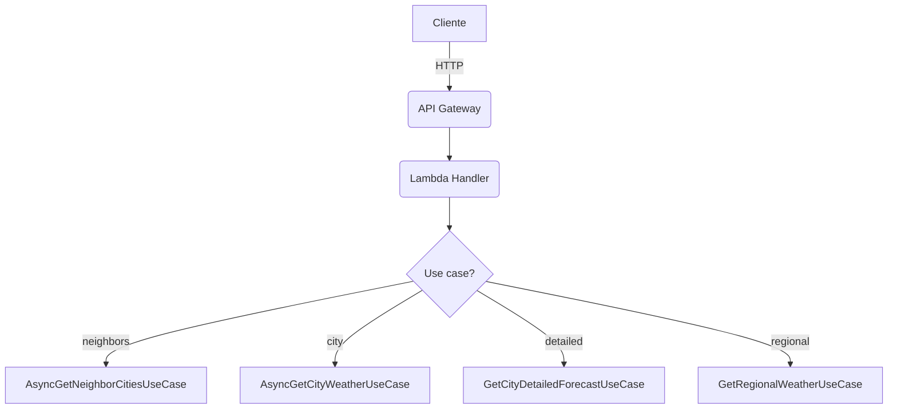
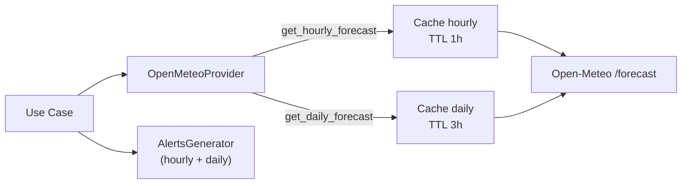

# Rotas da API

## Sumário rápido
- `GET /api/cities/neighbors/{cityId}?radius=50` — retorna cidade central + vizinhas dentro do raio.
- `GET /api/weather/city/{cityId}?date=YYYY-MM-DD&time=HH:MM` — clima atual/projetado para a data/hora alvo.
- `GET /api/weather/city/{cityId}/detailed?...` — previsão detalhada (current extraído do hourly + daily 16 dias + hourly 48h).
- `POST /api/weather/regional?...` — clima em paralelo para múltiplas cidades (lista no corpo).

## Parâmetros comuns
- `date` (query, opcional): `YYYY-MM-DD`. Se omitido, usa próximo horário disponível.
- `time` (query, opcional): `HH:MM`. Se omitido, usa 12:00.
- `cityId` (path): string numérica do município (IBGE).
- `radius` (query em neighbors): km, entre 1 e 500.
- Corpo da rota regional: `{ "cityIds": ["3543204", "3550506", ...] }`.

Erros de validação são convertidos por `ExceptionHandlerService` em JSON com `type`, `error`, `message` e `details`.

## Respostas e campos
### Weather (usado em city e regional)
- `cityId`, `cityName`
- `timestamp` (ISO, America/Sao_Paulo)
- `temperature`, `humidity`, `windSpeed`, `windDirection`
- `rainfallIntensity` (0–100), `rainfallProbability` (%), `rainVolumeHour` (mm/h), `dailyRainAccumulation` (mm)
- `description`, `feelsLike`, `pressure`, `visibility`, `clouds`, `cloudsDescription`
- `tempMin`, `tempMax`, `isDay`
- `weatherCode` (código proprietário) e `weatherAlert` (lista de alertas estruturados)

### ExtendedForecast (rota detailed)
- `cityInfo`: `cityId`, `cityName`, `state`
- `currentWeather`: Weather acima
- `dailyForecasts[]` (16 dias): `date`, `tempMin/Max`, `precipitationMm`, `rainProbability`, `rainfallIntensity`, `windSpeed/Direction`, `uvIndex`, `uvRiskLevel/Color`, `sunrise/sunset`, `precipitationHours`, `daylightHours`, `weatherCode`, `description`
- `hourlyForecasts[]` (48h): `timestamp`, `temperature`, `precipitation`, `precipitationProbability`, `rainfallIntensity`, `humidity`, `windSpeed/Direction`, `cloudCover`, `pressure?`, `visibility?`, `uvIndex?`, `isDay?`, `apparentTemperature?`, `weatherCode`, `description`
- `extendedAvailable`: `true|false`, `forecastDays`

### Neighbor cities
- `centerCity`: `id`, `name`, `latitude`, `longitude`
- `neighbors[]`: `id`, `name`, `latitude`, `longitude`, `distance`

## Erros padrão
| HTTP | Tipo                        | Quando                                                |
|------|-----------------------------|-------------------------------------------------------|
| 400  | `InvalidRadiusException`    | Raio fora do intervalo permitido                      |
| 400  | `InvalidDateTimeException`  | Formato de `date`/`time` inválido                     |
| 400  | `ValidationError`           | `cityIds` não é array ou `cityId` não numérico        |
| 404  | `CityNotFoundException`     | ID não existe no repositório                         |
| 404  | `CoordinatesNotFoundException` | Cidade sem coordenadas                              |
| 404  | `WeatherDataNotFoundException` | Provider sem dados válidos                          |
| 500  | `Internal server error`     | Erro inesperado                                       |

## Exemplos de chamadas
- **Clima da cidade**  
  `GET /api/weather/city/3543204?date=2025-12-01&time=15:00`

- **Previsão detalhada**  
  `GET /api/weather/city/3543204/detailed?date=2025-12-01`

- **Cidades vizinhas**  
  `GET /api/cities/neighbors/3543204?radius=75`

- **Clima regional**  
  `POST /api/weather/regional?time=09:00`  
  Corpo: `{"cityIds":["3543204","3550506","3543402"]}`

## Fluxo de caching por rota

## Contratos de retorno detalhados
- **Alertas**: ver `docs/development/alerts.md` para a lista de códigos, severidades e campos extras.
- **Domínio**: campos completos de entidades em `docs/development/domain-model.md`.
