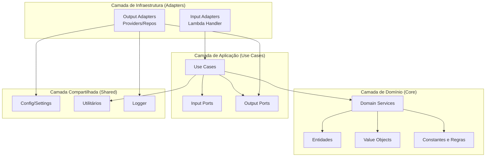
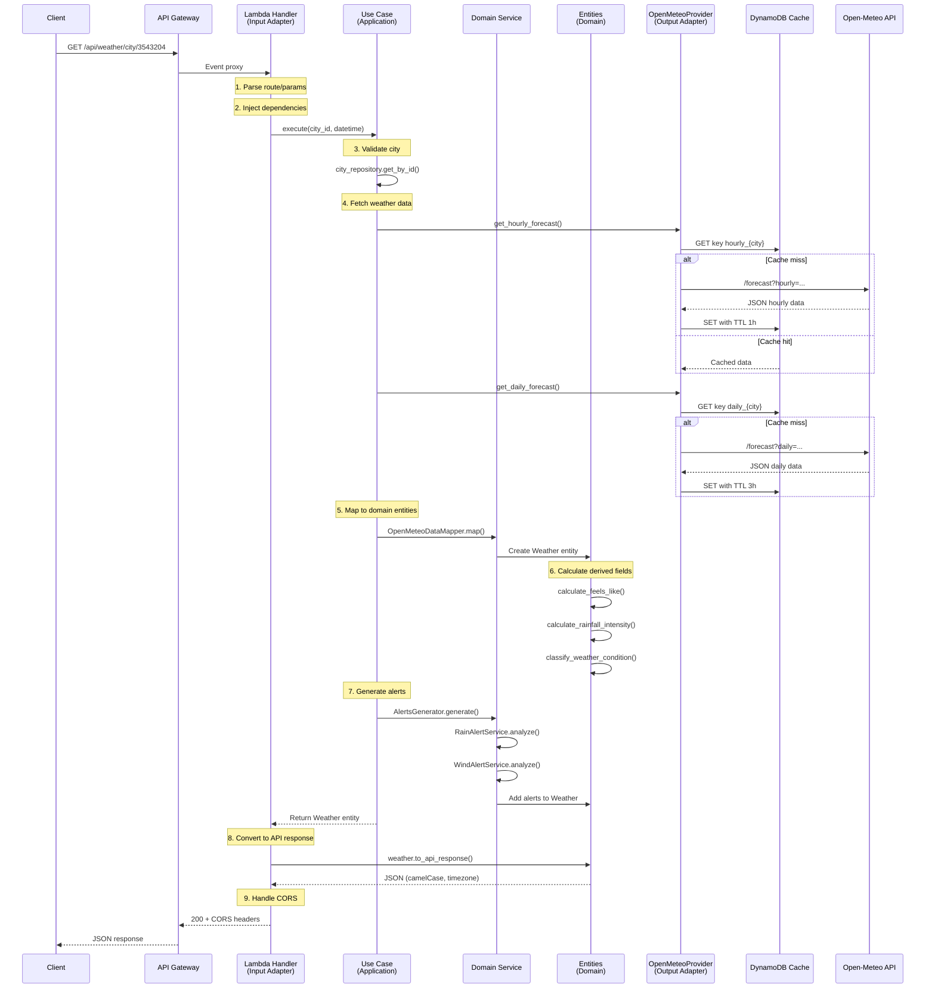

# Clean Architecture na BKD Weather Forecast

## Visão Geral
Este projeto adota os princípios de **Clean Architecture** (Arquitetura Limpa) conforme proposto por Robert C. Martin, garantindo separação clara de responsabilidades, testabilidade e independência de frameworks e infraestrutura.



## Princípios Fundamentais

### 1. Inversão de Dependências (Dependency Inversion)
As camadas internas (domínio) **não conhecem** as camadas externas (infraestrutura). A comunicação ocorre através de **portas (interfaces)** e **adaptadores (implementações)**.

**Exemplo prático:**
```python
# Porta (Interface) - Camada de Aplicação
# lambda/application/ports/output/weather_provider_port.py
class WeatherProviderPort(ABC):
    @abstractmethod
    async def get_hourly_forecast(self, latitude: float, longitude: float) -> dict:
        pass
    
    @abstractmethod
    async def get_daily_forecast(self, latitude: float, longitude: float) -> dict:
        pass
```

```python
# Adaptador (Implementação) - Camada de Infraestrutura
# lambda/infrastructure/adapters/output/providers/openmeteo/openmeteo_provider.py
class OpenMeteoProvider(WeatherProviderPort):
    async def get_hourly_forecast(self, latitude: float, longitude: float) -> dict:
        # Implementação concreta usando Open-Meteo API
        url = f"{self.base_url}/forecast?latitude={latitude}&longitude={longitude}..."
        # ... lógica de cache, retry, etc.
```

### 2. Separação de Responsabilidades
Cada camada tem uma função específica e não deve invadir responsabilidades de outras camadas.

## Estrutura de Camadas

### 🔵 Camada de Domínio (`lambda/domain/`)
**Responsabilidade:** Regras de negócio puras, independentes de frameworks e infraestrutura.

**Componentes:**
- **Entidades** (`domain/entities/`)
  - `City`: representa município brasileiro com coordenadas
  - `Weather`: clima em um instante com alertas e classificação
  - `HourlyForecast`: previsão horária (até 168h)
  - `DailyForecast`: previsão diária (até 16 dias)
  - `ExtendedForecast`: agregado de previsões

- **Value Objects** (`domain/value_objects/`)
  - `Temperature`: encapsula valor de temperatura com conversões e validações
  - `Coordinates`: latitude/longitude com cálculo de distância Haversine

- **Domain Services** (`domain/services/`)
  - `WeatherAlertOrchestrator`: coordena geração de alertas
  - `AlertsGenerator`: gera alertas para N dias combinando hourly + daily
  - `RainAlertService`, `WindAlertService`, `VisibilityAlertService`, `TemperatureAlertService`: lógica específica por tipo de alerta
  - `WeatherEnricher`: enriquece Weather com dados do hourly mais próximo
  - `OpenMeteoDataMapper`: converte dados externos em entidades de domínio

- **Constantes** (`domain/constants.py`)
  - Thresholds de alertas (vento, chuva, temperatura, UV)
  - Códigos proprietários de clima (100-999)
  - Limites geográficos e defaults

**Princípio chave:** Esta camada **nunca** importa de `application` ou `infrastructure`.

**Exemplo de entidade rica:**
```python
# lambda/domain/entities/weather.py (simplificado)
@dataclass
class Weather:
    city_id: str
    city_name: str
    timestamp: datetime
    temperature: float
    humidity: float
    # ... outros campos
    
    def to_api_response(self) -> dict:
        """Converte para formato camelCase da API"""
        # Lógica de conversão e timezone
        
    @staticmethod
    def from_hourly_data(city: City, hourly_data: dict, target_datetime: datetime) -> "Weather":
        """Factory method que cria Weather a partir de dados hourly"""
        # Extrai dados do hourly mais próximo
        # Calcula feels_like, rainfall_intensity
        # Gera alertas
```

### 🟢 Camada de Aplicação (`lambda/application/`)
**Responsabilidade:** Orquestrar casos de uso (fluxos de negócio) sem conhecer detalhes de implementação.

**Componentes:**
- **Use Cases** (`application/use_cases/`)
  - `AsyncGetCityWeatherUseCase`: busca clima atual/projetado para uma cidade
  - `GetCityDetailedForecastUseCase`: retorna previsão completa (current + daily + hourly)
  - `GetRegionalWeatherUseCase`: executa clima de múltiplas cidades em paralelo
  - `AsyncGetNeighborCitiesUseCase`: calcula cidades vizinhas por raio

- **Input Ports** (`application/ports/input/`)
  - Definem contratos de entrada para os use cases
  - Ex: `GetCityWeatherPort`, `GetNeighborCitiesPort`

- **Output Ports** (`application/ports/output/`)
  - Definem contratos para providers e repositórios
  - Ex: `WeatherProviderPort`, `CityRepositoryPort`, `CacheRepositoryPort`

- **DTOs** (`application/dtos/`)
  - `requests.py`: objetos de requisição
  - `responses.py`: objetos de resposta

**Princípio chave:** Use cases **dependem de portas**, não de implementações concretas.

**Exemplo de use case:**
```python
# lambda/application/use_cases/get_city_weather_use_case.py (simplificado)
class AsyncGetCityWeatherUseCase:
    def __init__(
        self,
        city_repository: CityRepositoryPort,
        weather_provider: WeatherProviderPort
    ):
        self.city_repository = city_repository
        self.weather_provider = weather_provider
    
    async def execute(self, city_id: str, target_datetime: datetime) -> Weather:
        # 1. Buscar cidade (pode lançar CityNotFoundException)
        city = self.city_repository.get_by_id(city_id)
        
        # 2. Buscar dados meteorológicos em paralelo
        hourly_data, daily_data = await asyncio.gather(
            self.weather_provider.get_hourly_forecast(city.latitude, city.longitude),
            self.weather_provider.get_daily_forecast(city.latitude, city.longitude)
        )
        
        # 3. Extrair Weather do hourly + gerar alertas com daily
        weather = Weather.from_hourly_data(city, hourly_data, target_datetime)
        # ... lógica de geração de alertas
        
        return weather
```

### 🟡 Camada de Infraestrutura (`lambda/infrastructure/`)
**Responsabilidade:** Implementações concretas de portas, comunicação com APIs externas, cache, handlers.

**Componentes:**

**Input Adapters** (`infrastructure/adapters/input/`)
- `lambda_handler.py`: orquestra rotas do API Gateway e traduz para use cases
- `exception_handler_service.py`: converte exceções de domínio em HTTP responses

**Output Adapters** (`infrastructure/adapters/output/`)
- **Providers** (`providers/openmeteo/`)
  - `OpenMeteoProvider`: implementa `WeatherProviderPort`
  - `OpenMeteoDataMapper`: converte payloads Open-Meteo em entidades

- **Repositories** 
  - `MunicipalitiesRepository`: carrega e indexa municípios do JSON
  
- **Cache** (`cache/`)
  - `AsyncDynamoDBCache`: implementa `CacheRepositoryPort` com TTLs

- **HTTP Managers** (`http/`)
  - `AiohttpSessionManager`: gerencia pool de conexões aiohttp
  - `DynamoDBClientManager`: gerencia cliente aioboto3

**Exemplo de adaptador:**
```python
# lambda_handler.py (simplificado)
def lambda_handler(event: dict, context: Any) -> dict:
    """Entry point da Lambda - Input Adapter"""
    path = event.get('path', '')
    method = event.get('httpMethod', '')
    
    # Injeta dependências (DI manual)
    city_repository = MunicipalitiesRepository()
    weather_provider = WeatherProviderFactory.create()
    
    if path.startswith('/api/weather/city/') and method == 'GET':
        use_case = AsyncGetCityWeatherUseCase(city_repository, weather_provider)
        # ... parse params, execute, format response
```

### 🟣 Camada Compartilhada (`lambda/shared/`)
**Responsabilidade:** Utilitários cross-cutting, configurações e helpers genéricos.

**Componentes:**
- `config/settings.py`: configurações carregadas de variáveis de ambiente
- `utils/haversine.py`: cálculo de distância geográfica
- `utils/date_parser.py`: parsing e validação de datas
- `utils/exceptions.py`: exceções compartilhadas

## Fluxo de Requisição Completo

Vamos seguir uma requisição `GET /api/weather/city/3543204?date=2025-12-08&time=15:00`:



## Benefícios da Arquitetura

### ✅ Testabilidade
- **Domínio puro**: testes unitários sem mocks de infraestrutura
- **Use cases**: mocks apenas das portas
- **Adapters**: testes de integração isolados

```python
# Exemplo de teste de domínio (sem mocks)
def test_weather_rainfall_intensity_calculation():
    weather = Weather(
        rain_1h=10.0,
        rain_probability=80.0,
        # ... outros campos
    )
    assert weather.rainfall_intensity == 26  # Cálculo puro
```

```python
# Exemplo de teste de use case (mock apenas da porta)
@pytest.mark.asyncio
async def test_get_city_weather_use_case():
    mock_repository = Mock(spec=CityRepositoryPort)
    mock_provider = AsyncMock(spec=WeatherProviderPort)
    
    use_case = AsyncGetCityWeatherUseCase(mock_repository, mock_provider)
    weather = await use_case.execute("3543204", datetime.now())
    
    mock_provider.get_hourly_forecast.assert_called_once()
```

### ✅ Manutenibilidade
- Mudanças em providers (ex: trocar Open-Meteo por outra API) não afetam domínio
- Regras de negócio centralizadas no domínio
- Fácil adicionar novos use cases reutilizando serviços de domínio

### ✅ Escalabilidade
- Casos de uso assíncronos com `asyncio`
- Event loop global reutilizado entre invocações
- Cache distribuído independente da lógica

### ✅ Independência de Frameworks
- Domínio não depende de AWS, Datadog, aiohttp, etc.
- Fácil migração para outro runtime (FastAPI, Flask, containers)

## Padrões de Design Aplicados

### Factory Pattern
```python
# lambda/infrastructure/adapters/output/providers/weather_provider_factory.py
class WeatherProviderFactory:
    @staticmethod
    def create(provider_type: str = "openmeteo") -> WeatherProviderPort:
        if provider_type == "openmeteo":
            return OpenMeteoProvider(...)
        # Fácil adicionar novos providers
```

### Repository Pattern
```python
# lambda/infrastructure/adapters/output/municipalities_repository.py
class MunicipalitiesRepository(CityRepositoryPort):
    def get_by_id(self, city_id: str) -> City:
        # Implementação específica (JSON em memória)
        
    def get_by_state(self, state: str) -> List[City]:
        # ...
```

### Service Layer
```python
# lambda/domain/services/weather_alert_orchestrator.py
class WeatherAlertOrchestrator:
    def __init__(self):
        self.rain_service = RainAlertService()
        self.wind_service = WindAlertService()
        # ...
    
    def generate_all_alerts(self, weather: Weather) -> List[WeatherAlert]:
        # Coordena múltiplos serviços de alerta
```

### Mapper Pattern
```python
# lambda/infrastructure/adapters/output/providers/openmeteo/mappers/openmeteo_data_mapper.py
class OpenMeteoDataMapper:
    @staticmethod
    def map_to_weather(city: City, data: dict) -> Weather:
        # Converte formato externo para entidade de domínio
```

## Diretrizes de Desenvolvimento

### ❌ Não Fazer
- Importar `infrastructure` dentro de `domain`
- Usar bibliotecas de infraestrutura (aiohttp, boto3) no domínio
- Lógica de negócio em handlers ou providers
- Entidades anêmicas (apenas getters/setters)

### ✅ Fazer
- Entidades ricas com comportamentos
- Validações no domínio
- Use cases focados e coesos
- Testes de cada camada isoladamente
- Injeção de dependências explícita

## Mapeamento de Arquivos

| Camada | Diretório | Exemplo de Arquivo |
|--------|-----------|-------------------|
| **Domínio** | `lambda/domain/` | `entities/weather.py`, `services/alerts_generator.py`, `constants.py` |
| **Aplicação** | `lambda/application/` | `use_cases/get_city_weather_use_case.py`, `ports/output/weather_provider_port.py` |
| **Infraestrutura** | `lambda/infrastructure/` | `adapters/input/lambda_handler.py`, `adapters/output/providers/openmeteo/openmeteo_provider.py` |
| **Compartilhado** | `lambda/shared/` | `config/settings.py`, `utils/haversine.py` |

## Evolução da Arquitetura

### Adicionando um Novo Provider de Clima

1. **Criar porta** (se não existir): `application/ports/output/weather_provider_port.py`
2. **Implementar adaptador**: `infrastructure/adapters/output/providers/acmeweather/acme_provider.py`
3. **Criar mapper**: `infrastructure/adapters/output/providers/acmeweather/mappers/acme_data_mapper.py`
4. **Atualizar factory**: `weather_provider_factory.py`
5. **Testes isolados** do provider
6. **Domínio permanece intocado** ✅

### Adicionando um Novo Tipo de Alerta

1. **Criar serviço**: `domain/services/fog_alert_service.py` extends `BaseAlertService`
2. **Adicionar código**: `domain/alerts/primitives.py` (ex: `AlertCode.DENSE_FOG`)
3. **Integrar no orchestrator**: `domain/services/weather_alert_orchestrator.py`
4. **Testes de domínio puro** (sem mocks)

### Migrando de Lambda para FastAPI

1. **Criar novo input adapter**: `infrastructure/adapters/input/fastapi_controller.py`
2. **Reutilizar use cases** existentes (zero mudanças)
3. **Manter providers e cache** (zero mudanças)
4. **Domínio completamente intocado** ✅

## Conclusão

A Clean Architecture garante que o **domínio** (regras de negócio) permaneça protegido e independente de mudanças tecnológicas. As **portas e adaptadores** permitem flexibilidade sem sacrificar testabilidade. Os **use cases** orquestram fluxos complexos de forma clara e manutenível.

Este design permite que a BKD Weather Forecast evolua rapidamente, adicione novos providers, mude de runtime ou adicione novos tipos de alertas sem comprometer a estabilidade do core de negócio.
