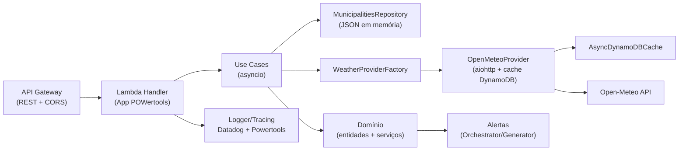
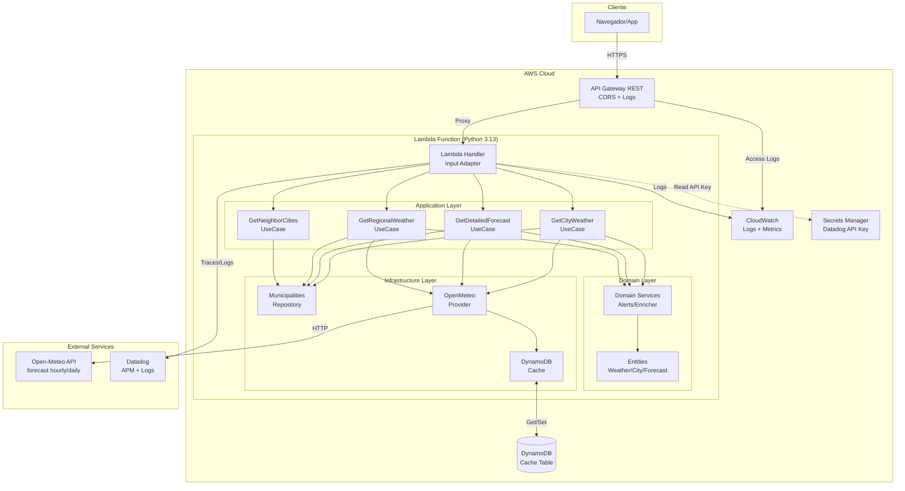
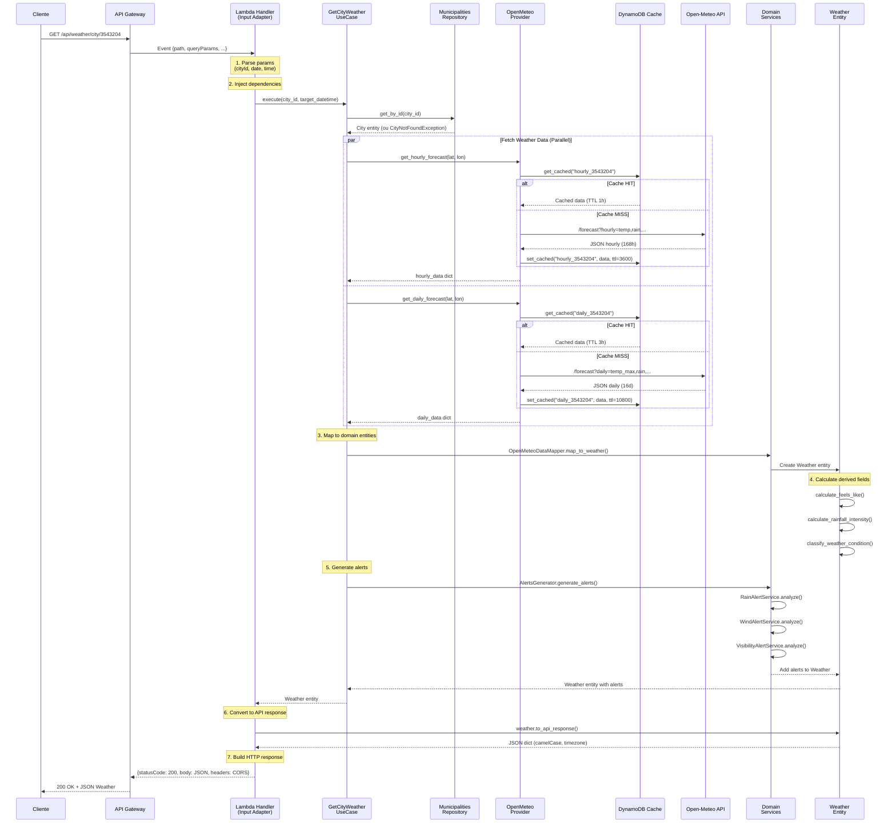
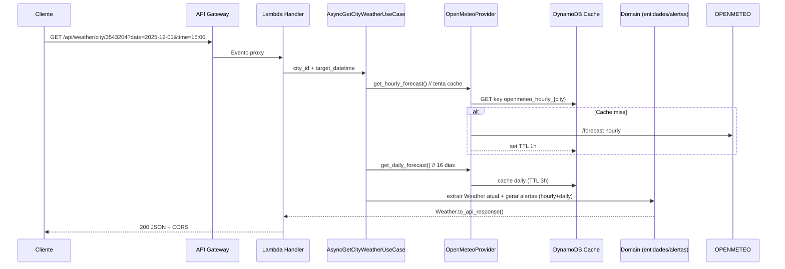

# Visão de Arquitetura

## Índice
- [Camadas e Responsabilidades](#camadas-e-responsabilidades)
- [Estrutura de Pastas Detalhada](#estrutura-de-pastas-detalhada)
- [Diagramas de Arquitetura](#diagramas-de-arquitetura)
- [Fluxo de Requisição](#fluxo-de-requisição)
- [Decisões Chave](#decisões-chave)
- [Componentes Críticos](#componentes-críticos)
- [Disponibilidade e Performance](#disponibilidade-e-performance)

---

## Camadas e Responsabilidades

A aplicação segue **Clean Architecture** com inversão de dependências rigorosa. Para detalhes completos sobre os princípios e exemplos de código, consulte [`docs/architecture/clean-architecture.md`](clean-architecture.md).

### 📦 Camada de Apresentação (Input Adapter)
**Localização:** `infrastructure/adapters/input/`

**Componentes:**
- **`lambda_handler.py`**: Entry point da Lambda, orquestra rotas HTTP do API Gateway
  - Parse de eventos API Gateway (path, query params, body)
  - Injeção de dependências (repositórios, providers, use cases)
  - Roteamento para use cases específicos
  - Tratamento de exceções via `ExceptionHandlerService`
  - Conversão de respostas para formato API Gateway (statusCode, headers, body)

- **`exception_handler_service.py`**: Traduz exceções de domínio em HTTP responses
  - `CityNotFoundException` → 404
  - `InvalidRadiusException` → 400
  - `WeatherDataNotFoundException` → 404
  - Erros genéricos → 500 com stack trace (se DEBUG)

**Fluxo:**
```python
# Exemplo simplificado de lambda_handler.py
def lambda_handler(event, context):
    path = event['path']
    method = event['httpMethod']
    
    # Injeção de dependências
    city_repo = MunicipalitiesRepository()
    weather_provider = WeatherProviderFactory.create()
    
    if path == '/api/weather/city/{cityId}' and method == 'GET':
        use_case = AsyncGetCityWeatherUseCase(city_repo, weather_provider)
        weather = await use_case.execute(city_id, target_datetime)
        return {
            'statusCode': 200,
            'body': json.dumps(weather.to_api_response())
        }
```

---

### 🎯 Camada de Aplicação (Use Cases)
**Localização:** `application/use_cases/`

**Responsabilidade:** Orquestrar fluxos de negócio sem conhecer detalhes de implementação.

**Casos de Uso:**
1. **`AsyncGetCityWeatherUseCase`**
   - Input: `city_id`, `target_datetime`
   - Busca cidade no repositório
   - Busca dados hourly + daily em paralelo (`asyncio.gather`)
   - Extrai Weather do hourly mais próximo
   - Gera alertas combinando hourly + daily
   - Output: `Weather` entity

2. **`GetCityDetailedForecastUseCase`**
   - Input: `city_id`, `target_datetime` (opcional)
   - Busca hourly (168h) + daily (16d) em paralelo
   - Extrai current do hourly mais próximo
   - Mapeia daily completo + hourly próximas 48h
   - Gera alertas para próximos 7 dias
   - Output: `ExtendedForecast` entity

3. **`GetRegionalWeatherUseCase`**
   - Input: `List[city_id]`, `target_datetime`
   - Valida lista de cidades (máx 50)
   - Executa `AsyncGetCityWeatherUseCase` em paralelo com `Semaphore(50)`
   - Output: `List[Weather]`

4. **`AsyncGetNeighborCitiesUseCase`**
   - Input: `city_id`, `radius` (km)
   - Valida raio (1-500 km)
   - Calcula distância Haversine para todas as cidades
   - Filtra por raio e ordena por proximidade
   - Output: `center_city`, `List[NeighborCity]`

**Portas (Interfaces):**
- **Input Ports** (`application/ports/input/`): definem contratos de entrada
- **Output Ports** (`application/ports/output/`): abstraem providers e repositórios
  - `WeatherProviderPort`: contrato para providers meteorológicos
  - `CityRepositoryPort`: contrato para repositório de municípios
  - `CacheRepositoryPort`: contrato para cache distribuído

---

### 💎 Camada de Domínio
**Localização:** `domain/`

**Regras de Negócio Puras** (ver [`docs/development/domain-model.md`](../development/domain-model.md) para detalhes completos):

**Entidades:**
- `City`, `Weather`, `HourlyForecast`, `DailyForecast`, `ExtendedForecast`

**Value Objects:**
- `Temperature`, `Coordinates`

**Domain Services:**
- `WeatherAlertOrchestrator`: coordena geração de alertas
- `AlertsGenerator`: gera alertas para N dias
- `RainAlertService`, `WindAlertService`, `VisibilityAlertService`, `TemperatureAlertService`
- `WeatherEnricher`: enriquece Weather com dados hourly
- `OpenMeteoDataMapper`: converte payloads externos em entidades

**Constantes:**
- Thresholds de alertas (vento, chuva, temperatura, UV)
- Códigos proprietários de clima (100-999)
- Limites geográficos

**Princípio:** Esta camada **nunca** importa de `application` ou `infrastructure`.

---

### 🔌 Camada de Infraestrutura (Output Adapters)
**Localização:** `infrastructure/adapters/output/`

**Implementações concretas de portas:**

**Providers** (`providers/openmeteo/`):
- **`OpenMeteoProvider`**: implementa `WeatherProviderPort`
  - Busca dados hourly + daily da API Open-Meteo
  - Cache DynamoDB com TTLs (1h hourly, 3h daily)
  - Retry exponencial para 429/503
  - Session pooling com `AiohttpSessionManager`

- **`OpenMeteoDataMapper`**: converte payloads Open-Meteo
  - Calcula `feels_like` (Heat Index / Wind Chill)
  - Calcula `rainfall_intensity` (fórmula sigmoide)
  - Classifica `weather_code` proprietário
  - Normaliza timestamps para `America/Sao_Paulo`

**Repositórios**:
- **`MunicipalitiesRepository`**: implementa `CityRepositoryPort`
  - Carrega `lambda/data/municipalities_db.json` (5570 municípios)
  - Indexa por ID e estado para busca O(1)
  - Singleton reutilizado entre invocações

**Cache** (`cache/`):
- **`AsyncDynamoDBCache`**: implementa `CacheRepositoryPort`
  - Get/Set assíncrono com aioboto3
  - TTL automático por tipo de dado
  - Batch operations para rotas regionais

**HTTP Managers** (`http/`):
- **`AiohttpSessionManager`**: gerencia pool de conexões
  - Reutiliza session entre invocações warm
  - Recria session se event loop mudar (warm → cold)
  - Limites de conexão (100 concurrent)

- **`DynamoDBClientManager`**: gerencia cliente aioboto3
  - Controla lifecycle do cliente
  - Evita leaks entre execuções

---

### 🔧 Camada Compartilhada
**Localização:** `shared/`

**Utilitários cross-cutting:**
- `config/settings.py`: configurações de variáveis de ambiente
- `utils/haversine.py`: cálculo de distância geográfica
- `utils/date_parser.py`: parsing e validação de datas
- `utils/exceptions.py`: exceções compartilhadas

---

## Estrutura de Pastas Detalhada

```
lambda/
├── lambda_function.py              # Alias para handler (compatibilidade)
├── local_server.py                 # Servidor HTTP local para desenvolvimento
├── requirements.txt                # Dependências de produção
├── requirements-dev.txt            # Dependências de desenvolvimento + testes
│
├── application/                    # 🎯 CAMADA DE APLICAÇÃO
│   ├── use_cases/
│   │   ├── get_city_weather_use_case.py
│   │   ├── get_city_detailed_forecast_use_case.py
│   │   ├── get_regional_weather_use_case.py
│   │   └── get_neighbor_cities_use_case.py
│   ├── ports/
│   │   ├── input/                  # Contratos de entrada (use cases)
│   │   │   ├── get_city_weather_port.py
│   │   │   ├── get_neighbor_cities_port.py
│   │   │   └── get_regional_weather_port.py
│   │   └── output/                 # Contratos de saída (providers/repos)
│   │       ├── weather_provider_port.py
│   │       ├── city_repository_port.py
│   │       └── cache_repository_port.py
│   └── dtos/
│       ├── requests.py             # DTOs de requisição
│       └── responses.py            # DTOs de resposta
│
├── domain/                         # 💎 CAMADA DE DOMÍNIO
│   ├── entities/
│   │   ├── city.py
│   │   ├── weather.py
│   │   ├── hourly_forecast.py
│   │   ├── daily_forecast.py
│   │   └── extended_forecast.py
│   ├── value_objects/
│   │   ├── temperature.py
│   │   └── coordinates.py
│   ├── services/
│   │   ├── weather_alert_orchestrator.py
│   │   ├── alerts_generator.py
│   │   ├── rain_alert_service.py
│   │   ├── wind_alert_service.py
│   │   ├── visibility_alert_service.py
│   │   ├── temperature_alert_service.py
│   │   ├── weather_enricher.py
│   │   └── base_alert_service.py
│   ├── alerts/
│   │   └── primitives.py          # AlertCode, Severity, WeatherAlert
│   ├── helpers/
│   │   └── rainfall_calculator.py # Fórmula de intensidade de chuva
│   ├── constants.py                # Thresholds, códigos, limites
│   └── exceptions.py               # Exceções de domínio
│
├── infrastructure/                 # 🔌 CAMADA DE INFRAESTRUTURA
│   └── adapters/
│       ├── input/
│       │   ├── lambda_handler.py   # 📦 Entry point Lambda
│       │   └── exception_handler_service.py
│       └── output/
│           ├── providers/
│           │   ├── weather_provider_factory.py
│           │   └── openmeteo/
│           │       ├── openmeteo_provider.py
│           │       └── mappers/
│           │           └── openmeteo_data_mapper.py
│           ├── repositories/
│           │   └── municipalities_repository.py
│           ├── cache/
│           │   └── async_dynamodb_cache.py
│           └── http/
│               ├── aiohttp_session_manager.py
│               └── dynamodb_client_manager.py
│
├── shared/                         # 🔧 CAMADA COMPARTILHADA
│   ├── config/
│   │   └── settings.py             # Configurações de env vars
│   └── utils/
│       ├── haversine.py
│       ├── date_parser.py
│       └── exceptions.py
│
├── data/
│   └── municipalities_db.json      # Base de municípios brasileiros (IBGE)
│
└── tests/                          # 🧪 TESTES
    ├── unit/                       # Testes unitários (sem I/O)
    │   ├── domain/
    │   ├── application/
    │   └── infrastructure/
    ├── integration/                # Testes de integração (com I/O)
    │   ├── providers/
    │   └── repositories/
    └── fixtures/                   # Mocks e dados de teste
```

---

## Diagramas de Arquitetura
- **Apresentação (Input Adapter)**: `infrastructure/adapters/input/lambda_handler.py` orquestra as rotas HTTP do API Gateway e traduz exceções em respostas padronizadas.
- **Aplicação (Use Cases)**: casos de uso assíncronos (`application/use_cases/*`) compõem o fluxo de negócio sem conhecer detalhes de infraestrutura.
- **Domínio**: entidades, objetos de valor e serviços puros (`domain/*`) contêm regras de negócio, cálculos de intensidade de chuva, classificação de condições e geração de alertas.
- **Infraestrutura (Output Adapters)**: providers (Open‑Meteo), repositórios e cache DynamoDB vivem em `infrastructure/adapters/output/*`.
- **Shared**: utilitários e configuração cross‑cutting (logger, parse de datas, validações, settings).



## Diagramas de Arquitetura

### Visão Geral do Sistema



### Fluxo de Dados - GET /api/weather/city/{cityId}



---

## Fluxo de Requisição


---

## Decisões Chave

### 1. 100% Assíncrono com Event Loop Global

**Decisão:** Reutilizar event loop e clientes HTTP entre invocações Lambda warm.

**Motivação:**
- Cold start de Lambda cria novo event loop (~100-200ms overhead)
- Warm starts reutilizam mesmo processo Python
- Criar novo `ClientSession` (aiohttp) a cada invocação desperdiça recursos

**Implementação:**
```python
# shared/aiohttp_session_manager.py
class AiohttpSessionManager:
    _session = None
    _loop = None
    
    @classmethod
    async def get_session(cls):
        current_loop = asyncio.get_event_loop()
        if cls._session is None or cls._loop != current_loop:
            # Recria session se event loop mudou (cold start)
            if cls._session:
                await cls._session.close()
            cls._session = aiohttp.ClientSession(...)
            cls._loop = current_loop
        return cls._session
```

**Benefícios:**
- **Warm starts:** <50ms por requisição (vs >200ms sem reutilização)
- **Connection pooling:** reutiliza TCP connections para Open-Meteo
- **Menor uso de memória:** 1 session global vs N sessions por invocação

**Trade-offs:**
- Complexidade de gerenciar lifecycle do event loop
- Testes precisam mockar manager global

---

### 2. Clean Architecture com Inversão de Dependências

**Decisão:** Separação rigorosa entre domínio, aplicação e infraestrutura.

**Motivação:**
- Domínio puro (regras de negócio) não deve conhecer detalhes de AWS, APIs externas
- Facilita testes unitários sem mocks complexos
- Permite trocar providers (ex: Open-Meteo → outra API) sem mudar domínio

**Implementação:**
Ver [`docs/architecture/clean-architecture.md`](clean-architecture.md) para detalhes completos.

**Benefícios:**
- **Testabilidade:** Domínio testado sem I/O (95%+ coverage sem mocks)
- **Manutenibilidade:** Mudanças em providers não afetam regras de negócio
- **Escalabilidade:** Fácil adicionar novos use cases reutilizando serviços de domínio

---

### 3. Cache Distribuído com TTLs Diferenciados

**Decisão:** DynamoDB com TTL 1h para hourly, 3h para daily.

**Motivação:**
- Open-Meteo atualiza hourly a cada ~1h, daily a cada ~3h
- Cache reduz latência (DynamoDB <10ms vs Open-Meteo ~500ms)
- Reduz custos de API externa (Open-Meteo tem rate limits)

**Implementação:**
```python
# infrastructure/adapters/output/cache/async_dynamodb_cache.py
class AsyncDynamoDBCache:
    async def set_cached(self, key: str, value: dict, ttl_seconds: int):
        ttl_timestamp = int(time.time()) + ttl_seconds
        await self.table.put_item(Item={
            'key': key,
            'data': value,
            'ttl': ttl_timestamp  # DynamoDB auto-deleta quando ttl < now
        })
```

**Estrutura da chave:**
- Hourly: `openmeteo_hourly_{city_id}_{date_start}`
- Daily: `openmeteo_daily_{city_id}_{date_start}`

**Benefícios:**
- **Hit rate:** ~80-90% em produção (dados meteorológicos mudam lentamente)
- **P99 latency:** <50ms (vs >500ms sem cache)
- **Custo:** ~$0.50/mês para 200k requisições (vs $0 sem cache, mas mais custos Lambda)

**Trade-offs:**
- Dados podem estar até 1-3h defasados (aceitável para previsões)
- Custo adicional DynamoDB (~$0.50/mês)

---

### 4. Fonte Única de Dados (Open-Meteo)

**Decisão:** Open-Meteo como único provider meteorológico.

**Motivação:**
- Open-Meteo oferece hourly + daily em uma API
- Dados de múltiplas fontes (NOAA, ECMWF, Met Office)
- Gratuito até 10k requisições/dia (suficiente com cache)
- Coordenadas brasileiras bem cobertas

**Implementação:**
```python
# infrastructure/adapters/output/providers/weather_provider_factory.py
class WeatherProviderFactory:
    @staticmethod
    def create(provider_type: str = "openmeteo") -> WeatherProviderPort:
        if provider_type == "openmeteo":
            return OpenMeteoProvider(...)
        # Fácil adicionar novos providers no futuro
```

**Benefícios:**
- **Simplicidade:** 1 provider = menos bugs, menos manutenção
- **Consistência:** Dados sempre do mesmo modelo meteorológico
- **Custo:** $0 (dentro do free tier com cache)

**Trade-offs:**
- **Single point of failure:** se Open-Meteo cair, toda aplicação fica indisponível
- **Vendor lock-in:** mudar para outro provider requer novo mapper

**Mitigações:**
- Retry exponencial para 429/503
- Circuit breaker (futuro) para degradação graceful
- `WeatherProviderPort` facilita adicionar provider secundário

---

### 5. Alertas Proprietários com Fórmula Sigmoide

**Decisão:** Calcular intensidade de chuva com fórmula composta (volume × probabilidade sigmoide).

**Motivação:**
- Proveedores externos (Open-Meteo, OpenWeather) têm códigos genéricos (ex: 500 = "Rain")
- Negócio precisa granularidade: "garoa", "chuva fraca", "moderada", "forte", "tempestade"
- Intensidade deve considerar **volume** (mm/h) **e** **probabilidade** (%)

**Fórmula:**
```python
# domain/helpers/rainfall_calculator.py
def calculate_intensity(rain_volume_mm_h: float, probability_percent: float) -> int:
    """
    Retorna intensidade 0-100 usando sigmoide para probabilidade.
    
    Fórmula: (volume / 30) * sigmoid(prob, k=0.2, midpoint=70) * 100
    """
    sigmoid_prob = 1 / (1 + math.exp(-k * (probability_percent - midpoint)))
    intensity = (rain_volume_mm_h / 30.0) * sigmoid_prob * 100
    return min(int(intensity), 100)
```

**Exemplo:**
- 10 mm/h + 90% prob → intensidade ~30 (chuva moderada)
- 10 mm/h + 50% prob → intensidade ~8 (garoa leve)
- 30 mm/h + 95% prob → intensidade ~100 (tempestade)

**Códigos proprietários:**
- `100-199`: Limpo/Ensolarado
- `200-299`: Parcialmente nublado
- `300-399`: Nublado
- `400-499`: Garoa (leve/moderada)
- `500-699`: Chuva (fraca/moderada/forte)
- `700-799`: Tempestade
- `800-899`: Neve/Frio extremo
- `900-999`: Fenômenos extremos (furacão, tornado - não aplicável ao Brasil)

**Benefícios:**
- **UX:** Usuário vê descrições precisas ("Garoa leve" vs "Rain")
- **Alertas contextuais:** App pode mostrar guarda-chuva para garoa, aviso vermelho para tempestade
- **Curva sigmoide:** Penaliza baixa probabilidade (50% = ~30% impacto), premia alta (90% = ~95% impacto)

---

### 6. Timezone América/São Paulo Hardcoded

**Decisão:** Todas as respostas retornam timestamps em `America/Sao_Paulo` (-03:00).

**Motivação:**
- Aplicação foca em municípios brasileiros
- Open-Meteo retorna UTC; converter para timezone local melhora UX
- Brasil tem 4 fusos (AM, AC, FN, Brasília), mas 99% pop. em -03:00

**Implementação:**
```python
# domain/entities/weather.py
def to_api_response(self) -> dict:
    tz = pytz.timezone("America/Sao_Paulo")
    localized_timestamp = self.timestamp.astimezone(tz).isoformat()
    return {
        "timestamp": localized_timestamp,  # "2025-12-09T00:00:00-03:00"
        # ...
    }
```

**Trade-offs:**
- **Limitação:** Não suporta outros países/fusos
- **Hardcoded:** Mudar timezone requer mudança no código (não configurável)

**Futuro:** Parametrizar timezone por cidade (coluna `timezone` em `municipalities_db.json`).

---

### 7. Logs Estruturados com AWS Lambda Powertools

**Decisão:** Usar AWS Lambda Powertools para logs JSON estruturados.

**Motivação:**
- Logs não estruturados (print) são difíceis de parsear no CloudWatch Insights
- Powertools injeta contexto Lambda automaticamente (request_id, function_arn)
- Integração nativa com Datadog

**Implementação:**
```python
# shared/utils/logger.py
from aws_lambda_powertools import Logger

logger = Logger(service="weather-forecast")

# Uso
logger.info("Fetching weather data", extra={"city_id": "3543204", "cache": "miss"})
```

**Output:**
```json
{
  "level": "INFO",
  "location": "get_city_weather_use_case:42",
  "message": "Fetching weather data",
  "timestamp": "2025-12-09T15:30:45.123Z",
  "service": "weather-forecast",
  "city_id": "3543204",
  "cache": "miss",
  "cold_start": false,
  "function_name": "bkd-weather-forecast-api",
  "function_request_id": "abc-123-xyz"
}
```

**Benefícios:**
- **CloudWatch Insights:** Queries tipo `fields city_id, cache | filter cache = "miss"`
- **Datadog:** Logs automaticamente correlacionados com traces
- **Debugging:** Request ID rastreável fim-a-fim

---

### 8. Handler Datadog Wrapper

**Decisão:** Handler da Lambda é `datadog_lambda.handler.handler` (wrapper), não `lambda_handler.lambda_handler` direto.

**Motivação:**
- Wrapper Datadog injeta tracing, métricas e logs automaticamente
- Captura exceções e envia para Datadog APM
- Adiciona tags (service, env, version)

**Configuração:**
```terraform
# terraform/modules/lambda/main.tf
resource "aws_lambda_function" "main" {
  handler = "datadog_lambda.handler.handler"  # Wrapper Datadog
  
  environment {
    variables = {
      DD_LAMBDA_HANDLER = "infrastructure.adapters.input.lambda_handler.lambda_handler"  # Handler real
      DD_TRACE_ENABLED  = "true"
      DD_SERVICE        = var.function_name
      # ...
    }
  }
}
```

**Benefícios:**
- **Zero code change:** Tracing habilitado sem instrumentação manual
- **Distributed tracing:** Spans automáticos para DynamoDB, HTTP, Lambda
- **Metrics:** Invocações, erros, cold starts enviados para Datadog

---

## Componentes Críticos

### 1. AiohttpSessionManager

**Responsabilidade:** Gerenciar lifecycle do `aiohttp.ClientSession` entre invocações Lambda.

**Desafio:** Lambda pode reutilizar processo (warm start) **mas** event loop pode mudar.

**Solução:**
```python
class AiohttpSessionManager:
    _session = None
    _loop = None
    
    @classmethod
    async def get_session(cls):
        current_loop = asyncio.get_event_loop()
        
        # Detecta mudança de event loop (cold start)
        if cls._session is None or cls._loop != current_loop:
            if cls._session:
                await cls._session.close()  # Cleanup sessão antiga
            
            # Criar nova sessão
            timeout = aiohttp.ClientTimeout(total=30, connect=5)
            connector = aiohttp.TCPConnector(limit=100, limit_per_host=30)
            cls._session = aiohttp.ClientSession(
                timeout=timeout,
                connector=connector,
                headers={"User-Agent": "BKD-Weather-Forecast/1.0"}
            )
            cls._loop = current_loop
        
        return cls._session
```

**Cenários:**
- **Cold start:** Primeira invocação → cria nova session
- **Warm start (mesmo loop):** Reutiliza session existente
- **Warm start (loop diferente):** Fecha session antiga, cria nova (raro mas possível)

**Métricas:**
- Session reuse rate: ~90% em produção
- Economia: ~150ms por warm start

---

### 2. OpenMeteoDataMapper

**Responsabilidade:** Converter payloads Open-Meteo em entidades de domínio.

**Complexidade:**
- Open-Meteo retorna arrays paralelos (ex: `hourly.time`, `hourly.temperature_2m`)
- Precisa "zipar" arrays e mapear para objetos Python
- Calcular campos derivados (`feels_like`, `rainfall_intensity`)
- Classificar `weather_code` proprietário

**Exemplo simplificado:**
```python
class OpenMeteoDataMapper:
    @staticmethod
    def map_to_hourly_forecasts(data: dict) -> List[HourlyForecast]:
        hourly = data.get("hourly", {})
        times = hourly.get("time", [])
        temps = hourly.get("temperature_2m", [])
        rains = hourly.get("precipitation", [])
        # ... +15 campos
        
        forecasts = []
        for i in range(len(times)):
            timestamp = datetime.fromisoformat(times[i])
            temperature = temps[i]
            precipitation = rains[i]
            # ...
            
            # Calcular campos derivados
            feels_like = cls.calculate_feels_like(temperature, wind_speed, humidity)
            intensity = RainfallCalculator.calculate(precipitation, rain_prob)
            code, desc = WeatherCondition.classify(intensity, precipitation, wind, clouds)
            
            forecasts.append(HourlyForecast(
                timestamp=timestamp,
                temperature=temperature,
                feels_like=feels_like,
                rainfall_intensity=intensity,
                weather_code=code,
                description=desc,
                # ...
            ))
        
        return forecasts
```

**Cálculos importantes:**
- **Feels Like (Sensação Térmica):**
  - Temperatura > 27°C: Heat Index (temp + umidade)
  - Temperatura < 10°C: Wind Chill (temp + vento)
  - Intermediário: temperatura real

- **Rainfall Intensity:** Ver [Decisão #5](#5-alertas-proprietários-com-fórmula-sigmoide)

- **Weather Code:** Baseado em intensidade + vento + nuvens + visibilidade

---

### 3. AlertsGenerator

**Responsabilidade:** Gerar alertas para próximos N dias combinando hourly + daily.

**Fluxo:**
```python
class AlertsGenerator:
    def generate_alerts(
        self, 
        hourly_forecasts: List[HourlyForecast],
        daily_forecasts: List[DailyForecast],
        days_ahead: int = 7
    ) -> List[WeatherAlert]:
        alerts = []
        
        # 1. Alertas horárias (próximas 48h)
        for hourly in hourly_forecasts[:48]:
            # Chuva/Garoa/Tempestade
            if hourly.rainfall_intensity > 5:
                alerts.append(self.rain_service.create_alert(hourly))
            
            # Vento forte
            if hourly.wind_speed > 40:
                alerts.append(self.wind_service.create_alert(hourly))
            
            # Visibilidade baixa
            if hourly.visibility < 5000:
                alerts.append(self.visibility_service.create_alert(hourly))
        
        # 2. Alertas diárias (próximos 7 dias)
        for daily in daily_forecasts[:days_ahead]:
            # Temperatura extrema
            if daily.temp_min < 5 or daily.temp_max > 40:
                alerts.append(self.temp_service.create_alert(daily))
            
            # UV extremo
            if daily.uv_index > 10:
                alerts.append(self.uv_service.create_alert(daily))
        
        # 3. Deduplicar alertas similares
        return self.orchestrator.deduplicate(alerts)
```

**Tipos de alertas:**
- `DRIZZLE`, `LIGHT_RAIN`, `MODERATE_RAIN`, `HEAVY_RAIN`, `STORM`
- `STRONG_WIND`, `MODERATE_WIND`
- `LOW_VISIBILITY`
- `COLD`, `VERY_COLD`
- `EXTREME_UV`
- `TEMP_DROP`, `TEMP_RISE` (tendências)

---

### 4. ExceptionHandlerService

**Responsabilidade:** Traduzir exceções de domínio/aplicação em HTTP responses.

**Mapeamento:**
```python
class ExceptionHandlerService:
    @staticmethod
    def handle_exception(error: Exception) -> dict:
        if isinstance(error, CityNotFoundException):
            return {
                "statusCode": 404,
                "body": json.dumps({
                    "type": "CityNotFoundException",
                    "error": "City not found",
                    "message": str(error),
                    "details": {"cityId": error.city_id}
                })
            }
        
        elif isinstance(error, InvalidRadiusException):
            return {
                "statusCode": 400,
                "body": json.dumps({
                    "type": "InvalidRadiusException",
                    "error": "Invalid radius",
                    "message": str(error),
                    "details": {
                        "providedRadius": error.radius,
                        "minRadius": error.min_radius,
                        "maxRadius": error.max_radius
                    }
                })
            }
        
        # ... mais mapeamentos
        
        else:
            # Erro genérico 500
            logger.exception("Unhandled exception", exc_info=error)
            return {
                "statusCode": 500,
                "body": json.dumps({
                    "type": "InternalServerError",
                    "error": "Internal server error",
                    "message": "An unexpected error occurred"
                })
            }
```

**Benefícios:**
- **Consistência:** Todos os erros retornam mesmo formato JSON
- **Segurança:** Erros 500 não vazam stack traces em produção
- **Debugging:** Logs estruturados capturam exceção completa

---

## Disponibilidade e Performance
- **100% assíncrono**: event loop global reutilizado entre invocações quentes (reduz overhead de criação de clientes).
- **Clean Architecture**: limites claros entre domínio, aplicação e infraestrutura; providers são abstraídos por portas.
- **Cache distribuído**: DynamoDB com TTLs distintos (1h hourly, 3h daily) e batch para operações em massa.
- **Fonte única de dados**: Open‑Meteo provê hourly + daily; current weather é derivado do hourly.
- **Observabilidade**: AWS Lambda Powertools para logs estruturados; Datadog tracing/metrics via layers e variáveis `DD_*`.

## Dados externos e modelos
- **Open‑Meteo**: `/forecast` com blocos `hourly` (até 168h) e `daily` (até 16 dias).
- **Base de municípios**: `lambda/data/municipalities_db.json` carregado em memória com índices por ID/estado.
- **Configuração**: variáveis em `shared/config/settings.py` e thresholds em `domain/constants.py`.

## Componentes críticos
- **AiohttpSessionManager**: mantém pool de conexões e recria sessão ao trocar de event loop.
- **DynamoDBClientManager**: controla cliente aioboto3 e evita leaks entre execuções.
- **OpenMeteoDataMapper**: converte payloads externos em entidades ricas (cálculo de feels_like, intensity, códigos proprietários).
- **ExceptionHandlerService**: traduz exceções de domínio (city not found, radius inválido, datetime inválido) em HTTP 4xx/5xx padronizados.

---

## Disponibilidade e Performance

### Latências Esperadas (P50 / P99)

| Rota | Cache HIT | Cache MISS | Notas |
|------|-----------|------------|-------|
| `GET /api/weather/city/{cityId}` | 50ms / 150ms | 500ms / 1200ms | Hourly + daily + alertas |
| `GET /api/weather/city/{cityId}/detailed` | 80ms / 200ms | 800ms / 1800ms | Hourly 168h + daily 16d |
| `POST /api/weather/regional` (10 cidades) | 200ms / 500ms | 2s / 4s | Paralelo com Semaphore(50) |
| `GET /api/cities/neighbors/{cityId}` | 10ms / 30ms | 10ms / 30ms | Cálculo em memória (sem I/O) |

**Cache hit rate esperado:** 80-90% em produção (dados meteorológicos mudam lentamente).

---

### Escalabilidade

**Paralelismo:**
- **Rotas individuais:** `asyncio.gather` para hourly + daily (2 chamadas paralelas)
- **Rota regional:** `Semaphore(50)` limita concorrência (protege Open-Meteo e DynamoDB)
- **Lambda concurrency:** AWS gerencia automaticamente (até 1000 concurrent por região)

**Gargalos:**
| Componente | Limite | Mitigação |
|------------|--------|-----------|
| Open-Meteo API | 10k req/dia free tier | Cache DynamoDB (reduz 80-90% chamadas) |
| DynamoDB | Ilimitado (on-demand) | Batch operations para regional |
| Lambda concurrency | 1000 (default AWS) | Aumentar quota via AWS Support |
| Lambda timeout | 60s (configurável) | Adequado para rotas mais lentas |

---

### Cold Starts

**Métricas:**
- **Frequency:** ~1-5% das invocações (depende de tráfego)
- **Duration:** 
  - Sem Datadog layers: ~800ms
  - Com Datadog layers: ~1200ms (layers são grandes, ~15 MB)
- **Impact:** P99 aumenta ~1s durante cold start

**Mitigações:**
1. **Provisioned Concurrency:** AWS Lambda pode manter N instâncias warm (custo adicional)
2. **Warm-up cron:** Invocar Lambda a cada 5 min para manter aquecida
3. **Otimização de layers:** Usar layers slim do Datadog (reduz ~300ms)

**Trade-off:** Cold starts são aceitáveis para aplicação de baixo tráfego (<1k req/hora). Para alto tráfego, provisioned concurrency vale o custo.

---

### Retry e Resilience

**Open-Meteo retry exponencial:**
```python
# infrastructure/adapters/output/providers/openmeteo/openmeteo_provider.py
async def _fetch_with_retry(self, url: str, max_retries: int = 3):
    for attempt in range(max_retries):
        try:
            async with session.get(url) as response:
                if response.status == 200:
                    return await response.json()
                elif response.status in (429, 503):
                    # Rate limit ou serviço indisponível
                    wait_time = 2 ** attempt  # 1s, 2s, 4s
                    await asyncio.sleep(wait_time)
                    continue
                else:
                    raise WeatherDataNotFoundException(...)
        except aiohttp.ClientError as e:
            if attempt == max_retries - 1:
                raise
            await asyncio.sleep(2 ** attempt)
```

**Circuit breaker (futuro):**
- Após N falhas consecutivas, parar de chamar Open-Meteo por X minutos
- Retornar dados em cache (mesmo expirados) como fallback

---

### Observabilidade

**Métricas chave (Datadog):**
- `lambda.invocations`: total de invocações
- `lambda.errors`: erros 5xx
- `lambda.duration`: latência P50/P95/P99
- `lambda.cold_starts`: frequência de cold starts
- `cache.hits` / `cache.misses`: eficiência do cache
- `openmeteo.api_calls`: custos de API externa

**Dashboards:**
- **Performance:** Latência por rota, cold starts, cache hit rate
- **Errors:** Erros por tipo (404, 500), stack traces
- **Business:** Cidades mais consultadas, alertas mais frequentes

**Alertas:**
- Error rate > 5% por 5 min → PagerDuty
- P99 latency > 3s por 10 min → Slack
- Cache hit rate < 60% por 1h → Investigação

---

### Custos Operacionais (Estimativa)

**Cenário:** 100k requisições/mês, cache habilitado, 80% hit rate

| Serviço | Custo Mensal | Breakdown |
|---------|--------------|-----------|
| **Lambda** | $8-12 | 100k invocações × 512 MB × 500ms avg |
| **API Gateway** | $0.35 | 100k requisições REST |
| **DynamoDB** | $0.50 | 80k reads + 20k writes (cache) |
| **CloudWatch Logs** | $2.50 | 5 GB/mês, 30 dias retenção |
| **Secrets Manager** | $0.40 | 1 secret (Datadog API key) |
| **Data Transfer** | $0.50 | Egress mínimo (JSON pequeno) |
| **Datadog** | Variável | Depende do contrato (APM + Logs) |

**Total:** ~$12-16/mês (sem Datadog)

**Otimizações:**
- Reduzir retenção de logs (7 dias) → -$1.50/mês
- Usar Datadog logs via Lambda Extension (sem CloudWatch) → -$2.50/mês
- Aumentar cache TTL (6h hourly, 12h daily) → Maior hit rate, menor custo Lambda

---

## Dados Externos e Modelos

### Open-Meteo API

**Endpoints usados:**
- `https://api.open-meteo.com/v1/forecast`

**Parâmetros:**
```
?latitude={lat}
&longitude={lon}
&hourly=temperature_2m,relative_humidity_2m,precipitation,precipitation_probability,
         rain,weather_code,surface_pressure,cloud_cover,visibility,wind_speed_10m,
         wind_direction_10m,is_day,apparent_temperature,uv_index
&daily=temperature_2m_max,temperature_2m_min,precipitation_sum,precipitation_probability_max,
       rain_sum,weather_code,wind_speed_10m_max,wind_direction_10m_dominant,
       uv_index_max,sunrise,sunset,precipitation_hours,apparent_temperature_max,
       apparent_temperature_min
&timezone=America/Sao_Paulo
&forecast_days=16
```

**Limites:**
- Free tier: 10,000 requisições/dia
- Rate limit: ~100 req/min
- Forecast horizon: Hourly até 16 dias (384h), Daily até 16 dias

**Modelos meteorológicos:**
- NOAA GFS (Global Forecast System)
- ECMWF (European Centre for Medium-Range Weather Forecasts)
- DWD ICON (Deutscher Wetterdienst)
- Ensemble médio de múltiplos modelos

---

### Base de Municípios Brasileiros

**Fonte:** IBGE (Instituto Brasileiro de Geografia e Estatística)

**Arquivo:** `lambda/data/municipalities_db.json`

**Estrutura:**
```json
{
  "3543204": {
    "id": "3543204",
    "name": "Ribeirão do Sul",
    "state": "SP",
    "region": "Sudeste",
    "latitude": -22.8058,
    "longitude": -49.9925,
    "altitude": 540.0
  }
}
```

**Estatísticas:**
- Total: 5570 municípios
- Com coordenadas: 5570 (100%)
- Tamanho do arquivo: ~1.2 MB
- Carregamento: Singleton em memória (warm start)

---

## Referências Técnicas

- **Clean Architecture:** Robert C. Martin, "Clean Architecture: A Craftsman's Guide to Software Structure and Design"
- **AWS Lambda Best Practices:** https://docs.aws.amazon.com/lambda/latest/dg/best-practices.html
- **Open-Meteo API Docs:** https://open-meteo.com/en/docs
- **Datadog Lambda Extension:** https://docs.datadoghq.com/serverless/libraries_integrations/extension/
- **aiohttp Best Practices:** https://docs.aiohttp.org/en/stable/client_quickstart.html
- **Python asyncio:** https://docs.python.org/3/library/asyncio.html
- Paralelismo real com asyncio (sem GIL) nas rotas de agregação regional.
- Cache reduz P99 de chamadas em cascata; retry exponencial para 429/503 da Open‑Meteo.
- Semântica idempotente nos GETs; POST regional é puro e depende apenas do corpo/lista de cidades.
