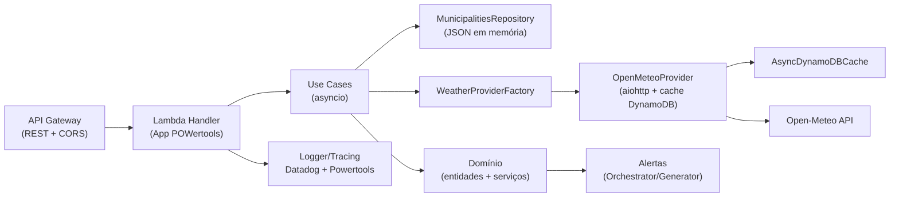
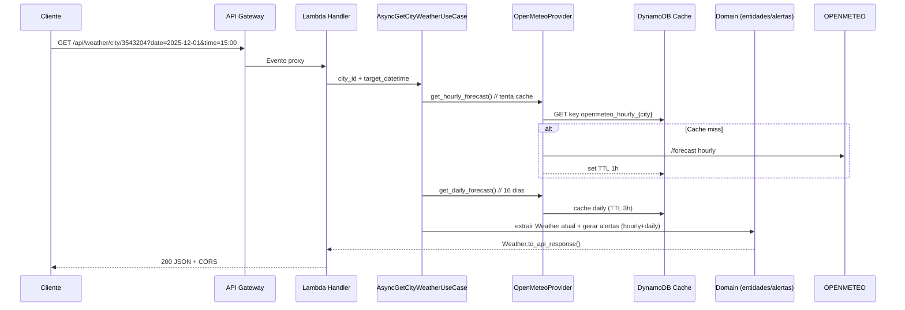

# Visão de Arquitetura

## Camadas e responsabilidades
- **Apresentação (Input Adapter)**: `infrastructure/adapters/input/lambda_handler.py` orquestra as rotas HTTP do API Gateway e traduz exceções em respostas padronizadas.
- **Aplicação (Use Cases)**: casos de uso assíncronos (`application/use_cases/*`) compõem o fluxo de negócio sem conhecer detalhes de infraestrutura.
- **Domínio**: entidades, objetos de valor e serviços puros (`domain/*`) contêm regras de negócio, cálculos de intensidade de chuva, classificação de condições e geração de alertas.
- **Infraestrutura (Output Adapters)**: providers (Open‑Meteo), repositórios e cache DynamoDB vivem em `infrastructure/adapters/output/*`.
- **Shared**: utilitários e configuração cross‑cutting (logger, parse de datas, validações, settings).

## Fluxo de requisição (ex.: GET /api/weather/city/{cityId})

## Decisões chave
- **100% assíncrono**: event loop global reutilizado entre invocações quentes (reduz overhead de criação de clientes).
- **Clean Architecture**: limites claros entre domínio, aplicação e infraestrutura; providers são abstraídos por portas.
- **Cache distribuído**: DynamoDB com TTLs distintos (1h hourly, 3h daily) e batch para operações em massa.
- **Fonte única de dados**: Open‑Meteo provê hourly + daily; current weather é derivado do hourly.
- **Observabilidade**: AWS Lambda Powertools para logs estruturados; Datadog tracing/metrics via layers e variáveis `DD_*`.

## Dados externos e modelos
- **Open‑Meteo**: `/forecast` com blocos `hourly` (até 168h) e `daily` (até 16 dias).
- **Base de municípios**: `lambda/data/municipalities_db.json` carregado em memória com índices por ID/estado.
- **Configuração**: variáveis em `shared/config/settings.py` e thresholds em `domain/constants.py`.

## Componentes críticos
- **AiohttpSessionManager**: mantém pool de conexões e recria sessão ao trocar de event loop.
- **DynamoDBClientManager**: controla cliente aioboto3 e evita leaks entre execuções.
- **OpenMeteoDataMapper**: converte payloads externos em entidades ricas (cálculo de feels_like, intensity, códigos proprietários).
- **ExceptionHandlerService**: traduz exceções de domínio (city not found, radius inválido, datetime inválido) em HTTP 4xx/5xx padronizados.

## Disponibilidade e performance
- Paralelismo real com asyncio (sem GIL) nas rotas de agregação regional.
- Cache reduz P99 de chamadas em cascata; retry exponencial para 429/503 da Open‑Meteo.
- Semântica idempotente nos GETs; POST regional é puro e depende apenas do corpo/lista de cidades.
