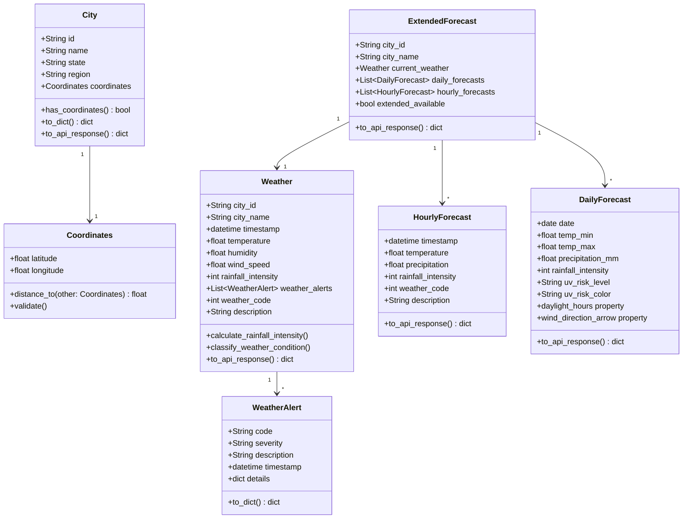

# Modelo de Domínio

## Índice
- [Visão Geral](#visão-geral)
- [Entidades Principais](#entidades-principais)
- [Objetos de Valor](#objetos-de-valor)
- [Constantes e Classificadores](#constantes-e-classificadores)
- [Serviços de Domínio](#serviços-de-domínio)
- [Casos de Uso](#casos-de-uso)
- [Repositórios e Providers](#repositórios-e-providers)
- [Cálculos e Fórmulas](#cálculos-e-fórmulas)
- [Serialização para API](#serialização-para-api)
- [Diagramas de Relacionamento](#diagramas-de-relacionamento)

---

## Visão Geral

O domínio da aplicação BKD Weather Forecast é modelado seguindo princípios de **Domain-Driven Design (DDD)**:
- **Entidades:** objetos com identidade única (City, Weather)
- **Value Objects:** objetos imutáveis sem identidade (Temperature, Coordinates)
- **Domain Services:** lógica de negócio que não pertence a uma entidade específica
- **Aggregates:** clusters de entidades e VOs com raiz agregada

**Linguagem Ubíqua (Ubiquitous Language):**
- **Município/City:** unidade geográfica brasileira (IBGE)
- **Previsão/Forecast:** dados meteorológicos futuros (hourly ou daily)
- **Alerta/Alert:** notificação de condição meteorológica relevante
- **Intensidade de Chuva/Rainfall Intensity:** métrica proprietária 0-100

---

## Entidades Principais
| Entidade | Campos-chave | Responsabilidade |
|----------|--------------|------------------|
| `City` (`domain/entities/city.py`) | `id`, `name`, `state`, `region`, `latitude`, `longitude` | Identifica município (IBGE). Possui `has_coordinates()` e conversões `to_dict`/`to_api_response`. |
| `NeighborCity` | `city`, `distance` | Wrapper com distância Haversine para a cidade central. |
| `Weather` | `city_id`, `city_name`, `timestamp`, `temperature`, `humidity`, `wind_speed`, `wind_direction`, `rain_probability`, `rain_1h`, `rain_accumulated_day`, `feels_like`, `pressure`, `visibility`, `clouds`, `temp_min`, `temp_max`, `is_day`, `weather_alert[]`, `weather_code`, `description` | Representa clima em um instante. Calcula `rainfall_intensity`, `clouds_description` e auto-classifica `weather_code/description` via `WeatherCondition.classify_weather_condition`. Converte timestamp para `America/Sao_Paulo` em `to_api_response()`. |
| `HourlyForecast` | `timestamp`, `temperature`, `precipitation`, `precipitation_probability`, `rainfall_intensity`, `humidity`, `wind_speed`, `wind_direction`, `cloud_cover`, `pressure?`, `visibility?`, `uv_index?`, `is_day?`, `apparent_temperature?`, `weather_code`, `description` | Previsão horária da Open‑Meteo (até 168h). Auto-classifica condição/clima se código não vier preenchido. |
| `DailyForecast` | `date`, `temp_min`, `temp_max`, `precipitation_mm`, `rain_probability`, `rainfall_intensity`, `wind_speed_max`, `wind_direction`, `uv_index`, `sunrise`, `sunset`, `precipitation_hours`, `apparent_temp_min?`, `apparent_temp_max?`, `weather_code`, `description` | Previsão diária estendida (16 dias). Expõe `daylight_hours`, `uv_risk_level/color`, `wind_direction_arrow`. Classe fábrica `from_openmeteo_data()` normaliza e calcula intensidade. |
| `ExtendedForecast` | `city_id`, `city_name`, `city_state`, `current_weather`, `daily_forecasts[]`, `hourly_forecasts[]`, `extended_available` | Agregado retornado pela rota detalhada: current (extraído do hourly), lista diária e hourly (48h) com flag de disponibilidade. |

## Objetos de valor
- `Temperature` (`domain/value_objects/temperature.py`): imutável, conversões para Fahrenheit/Kelvin, helpers (`is_hot`, `is_very_cold`, etc.) e validação contra zero absoluto.
- `Coordinates` (`domain/value_objects/coordinates.py`): valida faixas válidas, possui `distance_to()` que reutiliza `shared/utils/haversine.calculate_distance`.

## Constantes e classificadores
- `domain/constants.py` concentra thresholds de alertas (`Weather.WIND_SPEED_WARNING/DANGER`, `RAIN_INTENSITY_*`, `TEMP_EXTREME_*`), limites geográficos (`Geo.MIN/MAX_RADIUS`, `CENTER_CITY_*`) e códigos proprietários de condição (`WeatherCondition` 100–999).
- `WeatherCondition.classify_weather_condition(...)` usa intensidade de chuva, precipitação, vento, nuvens, visibilidade e temperatura para devolver `(code, description)` consistente entre hourly/daily/weather.
- `App` define defaults de previsão (`FORECAST_DAYS_DEFAULT=16`, `FORECAST_HOURS_DEFAULT=168`) e timezone.
- **Tabela de códigos de clima:** ver [`docs/development/weather-codes.md`](weather-codes.md) para a lista completa (100–999) com descrições e prioridades.

## Serviços de domínio
- `WeatherAlertOrchestrator`: fachada que agrupa serviços de chuva, vento, visibilidade e temperatura, deduplicando alertas.
- `AlertsGenerator`: gera alertas para próximos N dias combinando hourly + daily, detecta acumulado diário, tendências de temperatura e fim da chuva.
- `RainAlertService`, `WindAlertService`, `VisibilityAlertService`, `TemperatureAlertService`: regras específicas por fenômeno com severidades.
- `WeatherEnricher`: usa hourly mais próximo para enriquecer um `Weather` base (timestamp, variáveis, alertas).
- `OpenMeteoDataMapper`: transforma payloads externos em entidades de domínio, calcula `feels_like` e `rainfall_intensity` e preserva timezone.

## Casos de uso
- `AsyncGetCityWeatherUseCase`: busca hourly+daily em paralelo, deriva current a partir de hourly e gera alertas.
- `GetCityDetailedForecastUseCase`: Open‑Meteo only; retorna agregado com current + daily 16d + hourly 48h e alertas.
- `GetRegionalWeatherUseCase`: executa cidades em paralelo com `asyncio.gather` + `Semaphore(50)`; reutiliza dados hourly/daily para alertas.
- `AsyncGetNeighborCitiesUseCase`: calcula vizinhas por distância Haversine em memória, respeitando raio validado.

## Repositórios e providers
- `MunicipalitiesRepository`: carrega `lambda/data/municipalities_db.json` e indexa por ID/estado, singleton para warm starts.
- `OpenMeteoProvider`: provider padrão via `WeatherProviderFactory`; 100% aiohttp + cache DynamoDB (TTL 1h/3h) e retry exponencial para 429/503.
- Portas (`application/ports/*`): definem contratos para providers, repositórios e casos de uso de entrada.

## Cálculos e fórmulas
- **Intensidade de chuva** (`domain/helpers/rainfall_calculator.py`): `composite = (rain_volume_mm_h / 30) * sigmoid(probabilidade, k=0.2, midpoint=70) * 100`, truncado em 100. Usado em hourly, daily e alertas.
- **Sensação térmica** (`OpenMeteoDataMapper.calculate_feels_like`): Heat Index para calor (>27°C) e Wind Chill para frio (<10°C com vento).

## Serialização para API
- `Weather.to_api_response()` e equivalentes em `HourlyForecast`/`DailyForecast` convertem para snake_case -> camelCase, arredondam valores e garantem timezone `America/Sao_Paulo`.
- Alertas usam `WeatherAlert.to_dict()` com `code`, `severity`, `description`, `timestamp` e `details` opcionais.

---

## Diagramas de Relacionamento

### Diagrama de Classes - Entidades Core

Para mais exemplos de código e detalhes completos sobre as regras de negócio, consulte os arquivos da camada de domínio em `lambda/domain/`.
