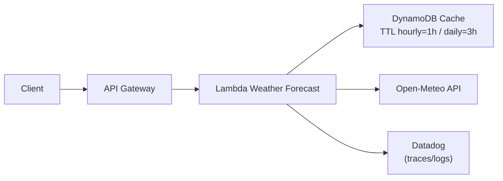

# Deploy e Infraestrutura

## Componentes AWS
- **Lambda**: runtime Python 3.13, handler `infrastructure.adapters.input.lambda_handler.lambda_handler`, event loop global e código empacotado em `terraform/build/lambda_function.zip`.
- **API Gateway REST**: rotas mapeadas para `/api/...` com CORS opcional; integrações proxy para a Lambda.
- **DynamoDB (cache)**: tabela configurável (`cache_table_name`) para cache de hourly/daily com TTLs dedicados.
- **IAM**: role da Lambda com políticas para CloudWatch, DynamoDB (se habilitado) e Secrets Manager (Datadog API key).
- **Datadog**: layers e extension configurados via variáveis `DD_*`; métricas e tracing habilitados por default.

## Build e empacotamento
- Script principal: `bash scripts/deploy-main.sh`
  - Ativa `.venv` e instala dependências de produção (`lambda/requirements.txt`) em `terraform/build/package/`.
  - Copia código `lambda/` (exceto testes) e remove metadados/artefatos.
  - Gera `terraform/build/lambda_function.zip` pronto para o Terraform.
  - Executa testes pré-build via `scripts/run_tests.sh` (unit + integração) antes do empacote.
- Para builds manuais: garanta `.venv` ativo e rode `pip install -r lambda/requirements.txt -t terraform/build/package`.

## Terraform
- Entrypoint: `terraform/main.tf` parametrizado por `terraform/terraform.tfvars`.
- Variáveis principais:
  - `aws_region`, `project_name`, `environment`
  - `lambda_function_name`, `lambda_timeout`, `lambda_memory_size`
  - `cache_table_name` (null desabilita cache e policy)
  - `datadog_api_key_secret_arn`, `datadog_layer_arn`, `datadog_extension_layer_arn`, `datadog_env`, `datadog_version`
  - `create_api_gateway`, `enable_cors`, `log_retention_days`
- Módulos:
  - `modules/lambda`: cria role/policies, log group, Lambda e injeta layers Datadog.
  - `modules/api-gateway`: recursos `/api/*`, métodos, integrações proxy, OPTIONS/CORS e role para CloudWatch logs.
  - `modules/observability`: reservado para camadas de monitoramento (ver diretório).
- Outputs úteis: `api_gateway_url`, `lambda_function_arn`, `cloudwatch_log_group_name`.

## Variáveis de ambiente da Lambda
- Clima/operacional: `CACHE_ENABLED`, `CACHE_TABLE_NAME`, `AWS_REGION`, `CORS_ORIGIN`.
- Datadog: `DD_API_KEY_SECRET_ARN`, `DD_SITE`, `DD_SERVICE`, `DD_ENV`, `DD_VERSION`, `DD_TRACE_ENABLED`, `DD_LOGS_INJECTION`.
- Defaults em `shared/config/settings.py` e `domain/constants.App/API/Cache`.

## Fluxo de deploy sugerido
1. `python -m venv .venv && source .venv/bin/activate`
2. `pip install -r lambda/requirements-dev.txt`
3. `bash scripts/run_tests.sh pre-deploy`
4. `bash scripts/deploy-main.sh` (gera zip em `terraform/build`)
5. `cd terraform && terraform init && terraform apply -var-file=terraform.tfvars`

## Observabilidade e operação
- Logs estruturados via AWS Lambda Powertools (`Logger`).
- Tracing distribuído com Datadog APM (DD_TRACE_ENABLED=true) e service mapping para DynamoDB.
- Métricas de cache e falhas ficam visíveis no Datadog via spans (`openmeteo.*`, `async_cache.*`).
