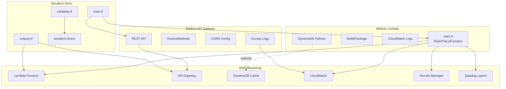

# Infraestrutura como Código com Terraform

## Visão Geral

A infraestrutura da BKD Weather Forecast é gerenciada 100% com **Terraform**, garantindo reprodutibilidade, versionamento e auditoria de todas as mudanças. O projeto utiliza uma arquitetura modular que facilita manutenção e reutilização.



## Estrutura de Arquivos

```
terraform/
├── main.tf                    # Entrypoint principal
├── variables.tf               # Declaração de variáveis
├── outputs.tf                 # Outputs exportados
├── terraform.tfvars           # Valores das variáveis (não versionado)
├── .terraform.lock.hcl        # Lock de providers
├── build/                     # Artefatos de build
│   ├── package/               # Dependências Python
│   └── lambda_function.zip    # Código empacotado
└── modules/
    ├── lambda/                # Módulo da função Lambda
    │   ├── main.tf
    │   ├── variables.tf
    │   ├── outputs.tf
    │   └── README.md
    ├── api-gateway/           # Módulo do API Gateway
    │   ├── main.tf
    │   ├── variables.tf
    │   ├── outputs.tf
    │   └── README.md
    └── observability/         # (Futuro) Dashboards/Alarms
```

## Variáveis de Configuração

### Variáveis Principais (variables.tf)

#### Configurações AWS
```terraform
variable "aws_region" {
  description = "Região AWS onde os recursos serão criados"
  type        = string
  default     = "us-east-1"
}
```
**Uso:** Define onde os recursos serão provisionados. Recomenda-se `us-east-1` para menor latência com Open-Meteo.

---

#### Projeto e Ambiente
```terraform
variable "project_name" {
  description = "Nome do projeto"
  type        = string
  default     = "api-lambda-test"
}

variable "environment" {
  description = "Ambiente (dev, staging, prod)"
  type        = string
  default     = "dev"
}
```
**Uso:** Identificam recursos e aparecem em tags. Altere para `bkd-weather-forecast` e `production` em produção.

---

#### Configuração da Lambda
```terraform
variable "lambda_function_name" {
  description = "Nome da função Lambda"
  type        = string
  default     = "api-lambda-test-function"
}

variable "lambda_timeout" {
  description = "Timeout da função Lambda em segundos"
  type        = number
  default     = 30  # Recomendado: 30-60s para rotas com cache
}

variable "lambda_memory_size" {
  description = "Memória alocada para a função Lambda em MB"
  type        = number
  default     = 256  # Mínimo 256MB; 512MB+ para produção
}

variable "lambda_environment_variables" {
  description = "Variáveis de ambiente para a função Lambda"
  type        = map(string)
  default = {
    ENVIRONMENT = "dev"
  }
}
```

**Notas importantes:**
- **Timeout:** Rotas com cache frio (DynamoDB miss + Open-Meteo) podem levar 5-10s. Reserve 30-60s.
- **Memory:** Mais memória = mais CPU proporcional. 512MB oferece bom custo-benefício para workloads assíncronos.
- **Environment Variables:** Variáveis customizadas serão mescladas com as injetadas automaticamente (Datadog, cache, região).

---

#### Cache DynamoDB
```terraform
variable "cache_table_name" {
  description = "Nome da tabela DynamoDB para cache (opcional, se null cache é desabilitado)"
  type        = string
  default     = null  # ou "weather-forecast-cache"
}
```

**Uso:**
- Se `null`: Cache desabilitado, todas as requisições vão direto para Open-Meteo
- Se definido: Cria políticas IAM para DynamoDB (tabela deve existir ou ser criada manualmente)
- **TTLs:** hourly=1h, daily=3h (hardcoded no código)

---

#### API Gateway
```terraform
variable "create_api_gateway" {
  description = "Se deve criar API Gateway para a Lambda"
  type        = bool
  default     = true
}

variable "enable_api_gateway_logs" {
  description = "Habilitar logs de acesso do API Gateway no CloudWatch"
  type        = bool
  default     = true
}

variable "enable_cors" {
  description = "Habilitar CORS no API Gateway"
  type        = bool
  default     = true
}
```

**Notas:**
- `create_api_gateway=false`: útil para testes apenas com invocação direta da Lambda
- CORS configurado para `*` (todos os origins) se `enable_cors=true`

---

#### Observabilidade - Datadog
```terraform
variable "datadog_api_key_secret_arn" {
  description = "ARN do secret no Secrets Manager contendo a API key do Datadog"
  type        = string
  # Exemplo: "arn:aws:secretsmanager:us-east-1:123456789:secret:datadog-api-key-abc123"
}

variable "datadog_layer_arn" {
  description = "ARN do Lambda Layer do Datadog para Python 3.13"
  type        = string
  # Exemplo: "arn:aws:lambda:us-east-1:464622532012:layer:Datadog-Python313:1"
}

variable "datadog_extension_layer_arn" {
  description = "ARN do Datadog Lambda Extension Layer"
  type        = string
  # Exemplo: "arn:aws:lambda:us-east-1:464622532012:layer:Datadog-Extension:65"
}

variable "datadog_site" {
  description = "Site do Datadog (datadoghq.com, datadoghq.eu, etc)"
  type        = string
  default     = "datadoghq.com"
}

variable "datadog_env" {
  description = "Environment tag para Datadog (dev, staging, production)"
  type        = string
  default     = "production"
}

variable "datadog_version" {
  description = "Version tag para Datadog"
  type        = string
  default     = "1.0.0"
}
```

**Configuração Datadog:**
1. Criar secret no AWS Secrets Manager com a API key do Datadog
2. Obter ARNs dos layers públicos do Datadog para Python 3.13:
   - Layer Datadog: https://github.com/DataDog/datadog-lambda-python/releases
   - Extension: https://docs.datadoghq.com/serverless/libraries_integrations/extension/
3. Configurar variáveis no `terraform.tfvars`

**Variáveis de ambiente injetadas automaticamente:**
- `DD_API_KEY_SECRET_ARN`
- `DD_SITE`
- `DD_SERVICE` = `var.lambda_function_name`
- `DD_ENV` = `var.datadog_env`
- `DD_VERSION` = `var.datadog_version`
- `DD_TRACE_ENABLED` = `true`
- `DD_LOGS_INJECTION` = `true`

---

#### Logs
```terraform
variable "log_retention_days" {
  description = "Número de dias para retenção dos logs no CloudWatch"
  type        = number
  default     = 7  # Recomendado: 7 (dev), 30 (prod)
}
```

---

## Módulos

### Módulo Lambda (`modules/lambda/`)

**Responsabilidades:**
- Criar IAM Role e Policies
- Provisionar função Lambda com layers Datadog
- Configurar CloudWatch Logs
- Gerenciar permissões para DynamoDB (se cache habilitado)
- Injetar variáveis de ambiente

**Inputs principais:**
| Variável | Tipo | Descrição |
|----------|------|-----------|
| `function_name` | string | Nome da função |
| `handler` | string | `datadog_lambda.handler.handler` (wrapper Datadog) |
| `runtime` | string | `python3.13` |
| `timeout` | number | Segundos antes de timeout |
| `memory_size` | number | MB de memória (128-10240) |
| `source_dir` | string | Path para `lambda/` (código será empacotado) |
| `cache_table_name` | string | Nome da tabela DynamoDB (ou null) |
| `datadog_*` | diversos | Configurações Datadog |

**Outputs:**
- `function_name`, `function_arn`, `invoke_arn`
- `role_arn`: IAM role da Lambda
- `log_group_name`: CloudWatch Log Group

**Recursos criados:**
- `aws_iam_role.lambda_role`
- `aws_iam_role_policy_attachment.lambda_basic_execution`
- `aws_iam_policy.lambda_dynamodb_policy` (condicional)
- `aws_iam_policy.lambda_secrets_policy` (Datadog)
- `aws_lambda_function.main`
- `aws_cloudwatch_log_group.lambda_log_group`

---

### Módulo API Gateway (`modules/api-gateway/`)

**Responsabilidades:**
- Criar API REST com rotas `/api/*`
- Configurar integrações proxy para Lambda
- Habilitar CORS (OPTIONS em todas as rotas)
- Configurar logs de acesso no CloudWatch
- Criar deployment e stage

**Inputs principais:**
| Variável | Tipo | Descrição |
|----------|------|-----------|
| `api_name` | string | Nome da API |
| `stage_name` | string | Nome do stage (dev, prod) |
| `lambda_invoke_arn` | string | ARN de invocação da Lambda |
| `lambda_function_name` | string | Nome da função (para permissões) |
| `enable_cors` | bool | Habilitar CORS |
| `enable_access_logs` | bool | Logs de acesso |

**Outputs:**
- `invoke_url`: URL base da API (ex: `https://abc123.execute-api.us-east-1.amazonaws.com/dev`)
- `api_id`, `api_execution_arn`

**Recursos criados:**
- `aws_api_gateway_rest_api.main`
- `aws_api_gateway_resource.*` (rotas `/api`, `/api/weather`, etc.)
- `aws_api_gateway_method.*` (GET, POST, OPTIONS)
- `aws_api_gateway_integration.*` (proxy para Lambda)
- `aws_api_gateway_deployment.main`
- `aws_api_gateway_stage.main`
- `aws_lambda_permission.api_gateway`
- `aws_cloudwatch_log_group.api_gateway_logs` (condicional)

**Rotas provisionadas:**
- `GET /api/weather/city/{cityId}`
- `GET /api/weather/city/{cityId}/detailed`
- `POST /api/weather/regional`
- `GET /api/cities/neighbors/{cityId}`
- `OPTIONS *` (para CORS)

---

## Fluxo de Deploy

### 1️⃣ Preparação do Ambiente

```bash
# Clone do repositório
git clone https://github.com/regisrfn/bkd-weather-forecast.git
cd bkd-weather-forecast

# Ativar ambiente virtual Python
python3 -m venv .venv
source .venv/bin/activate  # Linux/Mac
# ou .venv\Scripts\activate no Windows

# Instalar dependências de desenvolvimento
pip install -r lambda/requirements-dev.txt
```

---

### 2️⃣ Executar Testes (Pré-Deploy)

```bash
# Rodar testes unitários e de integração
bash scripts/run_tests.sh pre-deploy

# Ou manualmente
cd lambda
pytest tests/ --cov=. --cov-report=term-missing
```

**Importante:** Nunca faça deploy sem passar nos testes!

---

### 3️⃣ Build e Empacotamento

```bash
# Script automatizado (recomendado)
bash scripts/deploy-main.sh

# Ou manualmente:
cd terraform/build
rm -rf package lambda_function.zip
mkdir -p package

# Instalar dependências de produção
pip install -r ../../lambda/requirements.txt -t package/

# Copiar código da aplicação
cp -r ../../lambda/* package/
rm -rf package/tests package/__pycache__ package/*.pyc

# Criar zip
cd package
zip -r ../lambda_function.zip . -x "*.pyc" "*.pyo" "*__pycache__*"
cd ../..
```

**Output:** `terraform/build/lambda_function.zip` (~15-20 MB com dependências)

---

### 4️⃣ Configurar Variáveis

Crie/edite `terraform/terraform.tfvars`:

```hcl
# terraform.tfvars (exemplo de produção)

aws_region           = "us-east-1"
project_name         = "bkd-weather-forecast"
environment          = "production"
lambda_function_name = "bkd-weather-forecast-api"

# Performance
lambda_timeout      = 60
lambda_memory_size  = 512

# Cache
cache_table_name = "weather-forecast-cache"

# API Gateway
create_api_gateway       = true
enable_api_gateway_logs  = true
enable_cors              = true

# Logs
log_retention_days = 30

# Datadog (substitua pelos seus ARNs)
datadog_api_key_secret_arn  = "arn:aws:secretsmanager:us-east-1:123456789:secret:datadog-api-key-abc123"
datadog_layer_arn           = "arn:aws:lambda:us-east-1:464622532012:layer:Datadog-Python313:1"
datadog_extension_layer_arn = "arn:aws:lambda:us-east-1:464622532012:layer:Datadog-Extension:65"
datadog_site                = "datadoghq.com"
datadog_env                 = "production"
datadog_version             = "1.2.0"

# Variáveis customizadas da Lambda
lambda_environment_variables = {
  ENVIRONMENT        = "production"
  LOG_LEVEL          = "INFO"
  CACHE_ENABLED      = "true"
  CORS_ORIGIN        = "*"
  OPENMETEO_BASE_URL = "https://api.open-meteo.com/v1"
}
```

**⚠️ Segurança:** Nunca versione `terraform.tfvars` com secrets. Use `.gitignore`.

---

### 5️⃣ Terraform Init

```bash
cd terraform
terraform init
```

**O que faz:**
- Baixa provider AWS (~300 MB)
- Inicializa backend (local por padrão)
- Valida módulos

**Output esperado:**
```
Terraform has been successfully initialized!
```

---

### 6️⃣ Terraform Plan

```bash
terraform plan -var-file=terraform.tfvars
```

**O que faz:**
- Valida sintaxe
- Compara estado atual com desejado
- Mostra recursos que serão criados/modificados/destruídos

**Revisar:**
- Número de recursos a criar (esperado: ~20-30 na primeira execução)
- Nomes de recursos (devem refletir `project_name` e `environment`)
- Variáveis de ambiente injetadas

---

### 7️⃣ Terraform Apply

```bash
terraform apply -var-file=terraform.tfvars
```

**O que faz:**
- Cria todos os recursos AWS
- Faz upload do `lambda_function.zip` (~15-20 MB)
- Configura integrações e permissões
- Retorna outputs (URL da API, ARNs, etc.)

**Tempo estimado:** 2-5 minutos

**Output esperado:**
```
Apply complete! Resources: 28 added, 0 changed, 0 destroyed.

Outputs:

api_gateway_url = "https://abc123xyz.execute-api.us-east-1.amazonaws.com/production"
lambda_function_arn = "arn:aws:lambda:us-east-1:123456789:function:bkd-weather-forecast-api"
lambda_function_name = "bkd-weather-forecast-api"
cloudwatch_log_group_name = "/aws/lambda/bkd-weather-forecast-api"
```

---

### 8️⃣ Validação Pós-Deploy

```bash
# Obter URL da API
API_URL=$(terraform output -raw api_gateway_url)

# Testar rota de health/clima
curl "$API_URL/api/weather/city/3543204"

# Verificar logs em tempo real
aws logs tail /aws/lambda/bkd-weather-forecast-api --follow

# Verificar métricas no Datadog
# Acessar https://app.datadoghq.com/apm/services
```

**Checklist:**
- [ ] API retorna 200 OK com JSON válido
- [ ] Logs aparecem no CloudWatch
- [ ] Traces aparecem no Datadog APM
- [ ] Cache funcionando (verificar CloudWatch Insights)

---

## Atualizações e Mudanças

### Atualizar Código da Lambda

```bash
# 1. Fazer mudanças no código em lambda/
# 2. Rodar testes
bash scripts/run_tests.sh

# 3. Rebuild do zip
bash scripts/deploy-main.sh

# 4. Apply (Terraform detecta mudança no zip)
cd terraform
terraform apply -var-file=terraform.tfvars
```

**Nota:** Terraform compara hash do zip; se mudou, faz redeploy automático.

---

### Alterar Variáveis de Ambiente

Edite `terraform.tfvars`:
```hcl
lambda_environment_variables = {
  ENVIRONMENT   = "production"
  LOG_LEVEL     = "DEBUG"  # era INFO
  CACHE_ENABLED = "true"
  NEW_FEATURE   = "enabled"  # nova variável
}
```

```bash
terraform apply -var-file=terraform.tfvars
```

**Terraform recria a Lambda** se variáveis de ambiente mudarem.

---

### Escalar Performance

```hcl
# terraform.tfvars
lambda_timeout     = 90   # era 60
lambda_memory_size = 1024 # era 512
```

```bash
terraform apply -var-file=terraform.tfvars
```

**Impacto:** Mais memória = mais CPU = menor cold start. Custos aumentam proporcionalmente.

---

### Adicionar/Remover Cache

**Habilitar cache:**
```hcl
cache_table_name = "weather-forecast-cache"
```

**Desabilitar cache:**
```hcl
cache_table_name = null
```

```bash
terraform apply -var-file=terraform.tfvars
```

**Nota:** Tabela DynamoDB deve existir ou ser criada separadamente (não gerenciada pelo Terraform atualmente).

---

## Destruição de Recursos (Cleanup)

⚠️ **CUIDADO:** Isso destrói TODA a infraestrutura!

```bash
cd terraform
terraform destroy -var-file=terraform.tfvars
```

**Use para:**
- Ambientes de desenvolvimento temporários
- Testes de IaC
- Descomissionamento

**NÃO use em produção** sem backup completo!

---

## Boas Práticas

### ✅ Fazer

1. **Versionamento do estado:**
   ```hcl
   # backend.tf (exemplo com S3)
   terraform {
     backend "s3" {
       bucket = "my-terraform-state"
       key    = "weather-forecast/terraform.tfstate"
       region = "us-east-1"
     }
   }
   ```

2. **Workspaces para múltiplos ambientes:**
   ```bash
   terraform workspace new production
   terraform workspace new staging
   terraform workspace select production
   ```

3. **Tags consistentes:**
   - Todas as variáveis já aplicam tags via `default_tags` no provider
   - Adicione tags customizadas em `local.tags` se necessário

4. **Validação contínua:**
   ```bash
   terraform fmt -recursive  # Formatar código
   terraform validate        # Validar sintaxe
   ```

5. **Documentação inline:**
   - Usar `description` em todas as variáveis
   - Comentários em blocos complexos

---

### ❌ Evitar

1. **Secrets hardcoded:**
   - Usar AWS Secrets Manager para API keys
   - Nunca commitar `terraform.tfvars` com secrets

2. **Estado local em produção:**
   - Migrar para backend remoto (S3 + DynamoDB lock)

3. **Deploy direto sem plan:**
   - Sempre revisar `terraform plan` antes de `apply`

4. **Mudanças manuais no console AWS:**
   - Terraform perde controle; pode causar drift

5. **Falta de backups:**
   - Exportar estado: `terraform state pull > backup.tfstate`

---

## Troubleshooting

### Erro: "Access Denied" ao criar Lambda

**Causa:** Credenciais AWS não configuradas ou sem permissões

**Solução:**
```bash
aws configure
# ou
export AWS_ACCESS_KEY_ID="..."
export AWS_SECRET_ACCESS_KEY="..."
export AWS_SESSION_TOKEN="..."  # se usando MFA
```

---

### Erro: "lambda_function.zip not found"

**Causa:** Build não executado antes do `terraform apply`

**Solução:**
```bash
bash scripts/deploy-main.sh
# ou criar zip manualmente (ver seção Build)
```

---

### Erro: "DynamoDB table does not exist"

**Causa:** `cache_table_name` configurado mas tabela não existe

**Solução:**
- Criar tabela manualmente:
  ```bash
  aws dynamodb create-table \
    --table-name weather-forecast-cache \
    --attribute-definitions AttributeName=key,AttributeType=S \
    --key-schema AttributeName=key,KeyType=HASH \
    --billing-mode PAY_PER_REQUEST
  
  # Habilitar TTL
  aws dynamodb update-time-to-live \
    --table-name weather-forecast-cache \
    --time-to-live-specification "Enabled=true, AttributeName=ttl"
  ```

- Ou desabilitar cache: `cache_table_name = null`

---

### Erro: "Layer version does not exist"

**Causa:** ARN do layer Datadog inválido ou região incorreta

**Solução:**
- Verificar layers disponíveis:
  ```bash
  aws lambda list-layer-versions \
    --layer-name Datadog-Python313 \
    --region us-east-1
  ```
- Atualizar `datadog_layer_arn` em `terraform.tfvars`

---

### Lambda retorna 502 Bad Gateway

**Possíveis causas:**
1. Timeout excedido
2. Erro não tratado no código
3. Falta de permissões IAM

**Debugar:**
```bash
# Ver logs
aws logs tail /aws/lambda/bkd-weather-forecast-api --follow

# Invocar diretamente (bypass API Gateway)
aws lambda invoke \
  --function-name bkd-weather-forecast-api \
  --payload '{"httpMethod":"GET","path":"/api/weather/city/3543204"}' \
  response.json

cat response.json
```

---

## Estrutura de Custos AWS

### Estimativa Mensal (Produção, ~100k requisições/mês)

| Recurso | Configuração | Custo Estimado |
|---------|--------------|----------------|
| **Lambda** | 512 MB, 30s avg, 100k invocações | ~$8-12 |
| **API Gateway** | 100k requisições REST | ~$0.35 |
| **DynamoDB** | Cache, on-demand, 200k reads | ~$0.50 |
| **CloudWatch Logs** | 5 GB/mês, 30 dias retenção | ~$2.50 |
| **Datadog** | APM + Logs (via contrato) | Variável |
| **Secrets Manager** | 1 secret (API key Datadog) | ~$0.40 |
| **Data Transfer** | Minimal (Open-Meteo external) | ~$0.50 |

**Total:** ~$12-16/mês (sem Datadog)

**Free Tier:**
- Lambda: 1M requisições grátis/mês
- API Gateway: 1M requisições grátis/mês (12 primeiros meses)
- DynamoDB: 25 GB storage + 200M requisições grátis

---

## Próximos Passos

- [ ] Migrar estado para backend remoto (S3 + DynamoDB)
- [ ] Adicionar módulo `observability/` com CloudWatch Alarms
- [ ] Implementar CI/CD com GitHub Actions
- [ ] Adicionar WAF no API Gateway para proteção
- [ ] Configurar CloudFront para cache de borda
- [ ] Implementar testes de infraestrutura (Terratest)

---

## Referências

- [Documentação Terraform AWS Provider](https://registry.terraform.io/providers/hashicorp/aws/latest/docs)
- [AWS Lambda Best Practices](https://docs.aws.amazon.com/lambda/latest/dg/best-practices.html)
- [Datadog Lambda Extension](https://docs.datadoghq.com/serverless/libraries_integrations/extension/)
- [API Gateway REST API](https://docs.aws.amazon.com/apigateway/latest/developerguide/apigateway-rest-api.html)
- [Terraform Module Best Practices](https://www.terraform.io/language/modules/develop)
